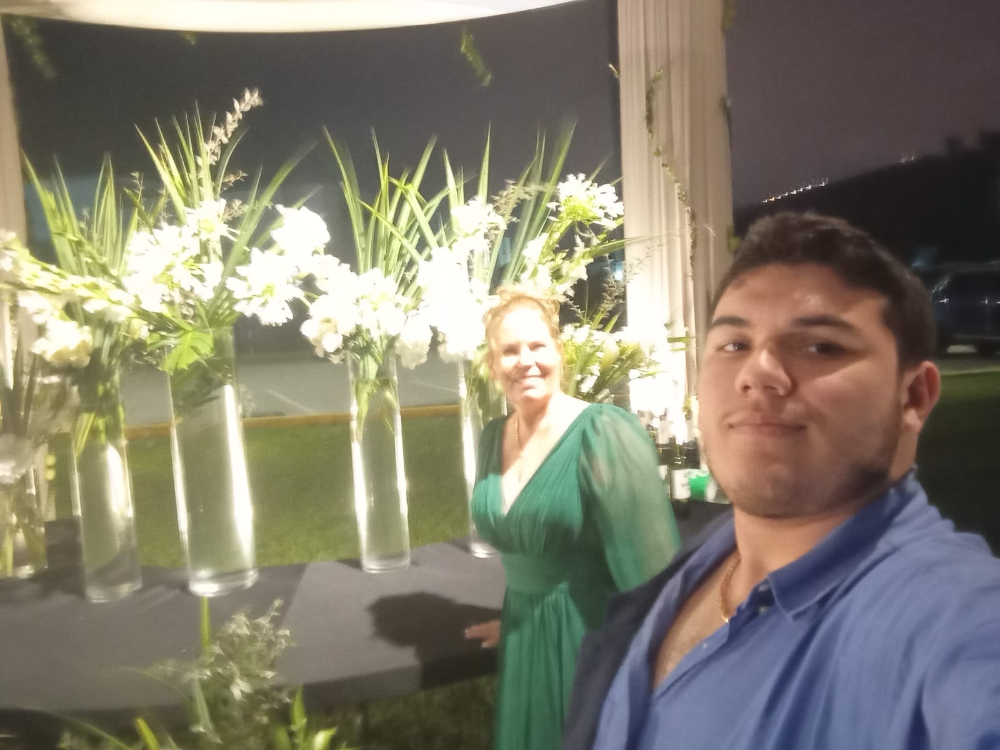
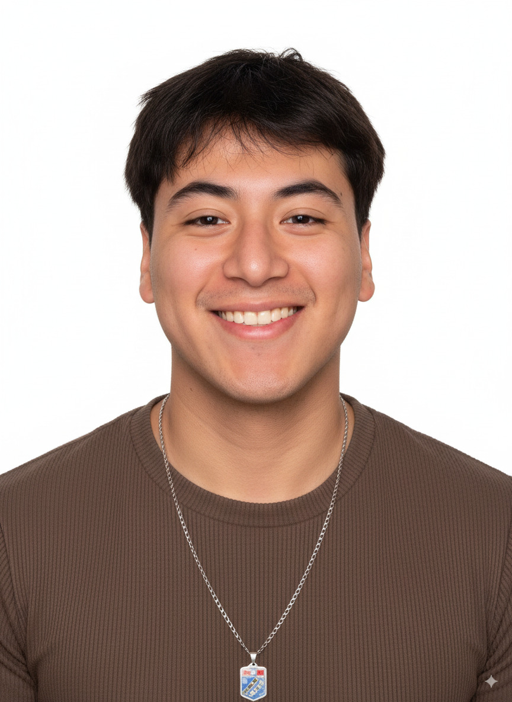

# UNIVERSIDAD PERUANA DE CIENCIAS APLICADAS

  

## FACULTAD DE INGENIERÍA
### CARRERA DE INGENIERÍA DE SOFTWARE

---

**CURSO:** 1ASI0722 - Agile Project Management  
**CICLO:** 2026-20  
**SECCIÓN:** 9286  
**PROFESOR:** Rouillon Sixto César Elías  

---

# INFORME DE TRABAJO FINAL: ENTREGA TB1

### **Nombre de la Startup:** Sisifo
### **Nombre del Producto:** SmartStay

---

### **Relación de Integrantes:**

| Código de Estudiante | Apellidos y Nombres | Carrera |
| :--- | :--- | :--- |
| U20221E617 | Verona Flores Italo Sebastian | Ingeniería de Software |
| U20221A390 | Su Caletti Eddo | Ingeniería de Software |
| U202212214 | Oskar Rodrigo  Sosa Soto | Ingeniería de Software |
| U202224867 | Ever Giusephi  Carlos Lavado| Ingeniería de Software |
| U202218645| Augusto Sebastian  Montes Maza | Ingeniería de Software |

---
**Mes y Año:** Septiembre, 2026  
**Repositorio GitHub:** [Organización](https://github.com/sisifoGroup)

# Registro de Versiones del Informe

El objetivo de esta sección es registrar y evidenciar las modificaciones, adiciones, correcciones o mejoras realizadas al informe durante el ciclo de vida del proyecto. Cada línea debe asociarse a un único autor y a commits concretos.

| Versión | Fecha | Autor | Descripción de Modificación |
| :---: | :---: | :--- | :--- |
| **1.0.0** | 11/09/2026 | Verona Flores Italo Sebastian | Creación de la estructura base del informe, carátula e integración del registro de versiones. |
| **1.0.1** | 11/09/2026 |  Su Caletti Eddo  | Me encargue de la parte de statup profile de los puntos descripción de la Startup y perfiles de Integrantes del Equipo. |
| **1.0.2** | 11/09/2026 | Oskar Rodrigo  Sosa Soto | Documentación de los perfiles individuales de los integrantes y roles preliminares. |
| **1.0.3** | 11/09/2026 | Ever Giusephi Carlos Lavado  | Formulación del Solution Profile: aplicación de técnica 5W2H y análisis del problema. |
| **1.0.4** | 11/09/2026 | Augusto Sebastian   Montes Maza| Definición de la Propuesta de Valor y caracterización de Segmentos Objetivo. |
| **1.1.0** | 11/09/2026 | [Nombre y Apellidos de Integrante] | Consolidación de los Objetivos SMART de los integrantes y tabla de Student Outcome. |
| **1.2.0** | 11/09/2026 | [Nombre y Apellidos de Integrante] | Revisión final de estilo APA 7, validación cruzada y compilación para la entrega TB1. |

# Tabla de Contenidos

1. [Student Outcome](#student-outcome)
2. [Objetivos SMART](#objetivos-smart)
3. [Capítulo I: Introducción](#capítulo-i-introducción)
   * 3.1. [Startup Profile](#31-startup-profile)
     * 3.1.1. [Descripción del Startup](#311-descripción-del-startup)
     * 3.1.2. [Perfiles de Integrantes del Equipo](#312-perfiles-de-integrantes-del-equipo)
   * 3.2. [Solution Profile](#32-solution-profile)
     * 3.2.1. [Nombre del Producto](#321-nombre-del-producto)
     * 3.2.2. [Antecedentes y Problemática (Técnica 5W2H)](#322-antecedentes-y-problemática-técnica-5w2h)
     * 3.2.3. [Lean UX Process](#323-lean-ux-process)
       * 3.2.3.1. [Lean UX Problem Statement](#3231-lean-ux-problem-statement)
       * 3.2.3.2. [Lean UX Assumptions](#3232-lean-ux-assumptions)
       * 3.2.3.3. [Lean UX Hypothesis](#3233-lean-ux-hypothesis)
       * 3.2.3.4. [Lean UX Canvas](#3234-lean-ux-canvas)
     * 3.2.4. [Propuesta de Valor](#324-propuesta-de-valor)
     * 3.2.5. [Segmentos Objetivo](#325-segmentos-objetivo)

# Student Outcome

### ABET - EAC - Student Outcome 2:
> *La capacidad de aplicar el diseño de ingeniería para producir soluciones que satisfagan necesidades específicas con consideración de salud pública, seguridad y bienestar, así como factores globales, culturales, sociales, ambientales y económicos.*

En la siguiente tabla se describen las acciones individuales realizadas y las conclusiones grupales correspondientes a la entrega **TB1**:

| Criterio Específico | Acciones Realizadas (Por Integrante - TB1) | Conclusiones Grupales |
| :--- | :--- | :--- |
| **Criterio 1:** Diseña productos o componentes en ingeniería de software que satisfacen necesidades específicas considerando el impacto en salud pública, seguridad y bienestar, así como factores globales, culturales, sociales, ambientales y económicos. | **Verona Flores, Italo Sebastian:** • Participó en la identificación preliminar de los componentes básicos de la plataforma SmartStay, considerando la seguridad de la información de los usuarios y el confort en la gestión de hospedajes.  **Su Caletti Eddo** • Colaboró en la descripción del problema de gestión hotelera evaluando el impacto económico en pequeños y medianos establecimientos y las descripcion de nuestro startup .  **Oskar Rodrigo  Sosa Soto** • Apoyó en la formulación de la propuesta de valor orientada a mejorar la experiencia y bienestar de los huéspedes.  **Ever Giusephi  Carlos Lavado** • Recopiló información sobre factores culturales y sociales en la interacción de usuarios y anfitriones.  **Augusto Sebastian Montes Maza** • Revisó consideraciones básicas de accesibilidad digital y protección de datos para la solución inicial. | Durante esta fase inicial (TB1), el equipo definió conceptualmente la solución SmartStay y el alcance preliminar del servicio, asegurando que los requerimientos base contemplen la seguridad de la información de los huéspedes y la accesibilidad del usuario. |
| **Criterio 2:** Diseña proyectos que permiten la implementación de soluciones en ingeniería de software considerando el impacto en salud pública, seguridad, bienestar, así como factores globales, culturales, sociales, ambientales y económicos. | **Verona Flores, Italo Sebastian:** • Apoyó en la estructuración de los objetivos iniciales del proyecto SmartStay y en la identificación de los stakeholders clave.  **Su Caletti Eddo:** • Participó en la delimitación de los antecedentes y el contexto del sector hotelero mediante la técnica 5W2H.  **Oskar Rodrigo  Sosa Soto:** • Colaboró en la definición preliminar de los segmentos objetivo (huéspedes y administradores de hospedajes).  **Ever Giusephi  Carlos Lavado:** • Ayudó a mapear los riesgos y restricciones tempranas del entorno donde operará la solución.  **Augusto Sebastian Montes Maza:** • Contribuyó en la definición de los canales de comunicación y coordinación inicial del equipo. | En este arranque, el equipo estructuró las bases del proyecto SmartStay aplicando técnicas de análisis del problema (5W2H) y alineando la planificación inicial con las necesidades operativas de los establecimientos de hospedaje. |
| **Criterio 3:** Diseña y ejecuta los procesos relacionados al desarrollo y mantenimiento de la solución de software en ingeniería considerando el impacto en salud pública, seguridad, bienestar, así como factores globales, culturales, sociales, ambientales y económicos. | **Verona Flores, Italo Sebastian:** • Colaboró en la configuración inicial del repositorio colaborativo en GitHub y en la adopción de las pautas de commits acordadas.  **Su Caletti Eddo :** • Participó en la organización de la documentación del informe en formato Markdown respetando la estructura exigida.  **Oskar Rodrigo  Sosa Soto:** • Apoyó en la configuración del tablero de seguimiento de tareas en Trello para la distribución de actividades.  **Ever Giusephi  Carlos Lavado:** • Ayudó a definir los acuerdos de equipo (*Working Agreements*) para el trabajo colaborativo en las iteraciones.  **Augusto Sebastian Montes Maza:** • Estableció los canales sincrónicos y asincrónicos para coordinar las reuniones semanales de seguimiento. | Se implementaron los procesos de trabajo colaborativo base (control de versiones en GitHub, tablero ágil en Trello y canales de comunicación), garantizando orden, transparencia y trazabilidad en la documentación de esta primera entrega. |

# Objetivos SMART

A continuación, cada miembro del equipo de trabajo formula un plan que incluye al menos **dos (2) objetivos SMART** orientados a su desarrollo y crecimiento profesional continuo una vez culminada la carrera universitaria:

### 1. Verona Flores, Italo Sebastian
* **Objetivo SMART 1 (Técnico / Especialización):**
  * *Específico (S):* Obtener la certificación oficial AWS Certified Solutions Architect – Associate y posteriormente la certificación Professional para consolidar competencias avanzadas en diseño de infraestructuras escalables en la nube.
  * *Medible (M):* Aprobar satisfactoriamente el examen de certificación Associate (con un puntaje mayor al 75%) y completar el roadmap de estudio para la certificación Professional en un plazo acumulado de 3 años.
  * *Alcanzable (A):* Destinar 8 horas semanales al estudio técnico especializado, realización de laboratorios prácticos en la consola de AWS y resolución de simuladores oficiales.
  * *Relevante (R):* Valida formalmente mis competencias técnicas en el mercado internacional, facilitando la postulación a roles senior y aportando valor directo en el diseño de arquitecturas robustas para proyectos propios o de terceros.
  * *Temporal (T):* Obtener la certificación Associate en los primeros 18 meses tras la graduación, y la certificación Professional en un plazo máximo de 3 años posteriores a la misma.

* **Objetivo SMART 2 (Desarrollo Profesional / Emprendimiento):**
  * *Específico (S):* Fundar y consolidar una startup tecnológica o consultoría de infraestructura independiente de modelo operativo 100% remoto, orientada al diseño y despliegue de soluciones en la nube.
  * *Medible (M):* Alcanzar un flujo de ingresos estables superior a los 15,000 soles mensuales y mantener una cartera activa de al menos 3 clientes recurrentes o proyectos propios escalados en producción.
  * *Alcanzable (A):* Validar el modelo de negocio y estructurar la oferta de servicios durante el último año de la carrera, apalancándome en redes profesionales y en las habilidades adquiridas en gestión ágil de proyectos.
  * *Relevante (R):* Permite alcanzar la autonomía financiera, la libertad técnica y la flexibilidad geográfica necesarias para consolidarme como referente en arquitectura de software y sostener mi desarrollo profesional continuo.
  * *Temporal (T):* En un plazo de 5 a 6 años contados a partir de la fecha de graduación profesional.

---

### 2. Su Caletti Eddo
* **Objetivo SMART 1 (Técnico / Especialización):**
  * *Específico (S):* Fortalecer mis competencias en desarrollo backend mediante el aprendizaje de Spring Boot y Java avanzado, y consolidar este conocimiento obteniendo la certificación internacional **Oracle Certified Professional: Java SE Developer**.
  * *Medible (M):* Desarrollar 2 proyectos académicos integrales con arquitectura REST API e integración a bases de datos relacionales, y aprobar el examen de certificación con una puntuación superior al 70%.
  * *Alcanzable (A):* Dedicar 6 horas semanales al estudio autodidacta, resolución de ejercicios prácticos en plataformas especializadas y la construcción progresiva del portafolio durante los próximos ciclos académicos.
  * *Relevante (R):* Garantiza el dominio de un estándar industrial altamente demandado en el desarrollo de software empresarial, respaldando formalmente mis habilidades técnicas antes de egresar.
  * *Temporal (T):* Completar la ruta de aprendizaje y obtener la certificación en un plazo máximo de 18 meses (al finalizar el 7.º ciclo).

* **Objetivo SMART 2 (Liderazgo / Desarrollo Profesional):**
  * *Específico (S):* Desarrollar habilidades de gestión de equipos y metodologías ágiles desempeñando el rol de *Scrum Master* o líder técnico en al menos dos proyectos académicos grupales de la carrera.
  * *Medible (M):* Implementar ceremonias ágiles (Sprint Planning, Daily Stand-ups, Retrospectivas) y mantener una tasa de cumplimiento de historias de usuario del 90% en los sprints planificados.
  * *Alcanzable (A):* Estudiar los marcos de trabajo Scrum y Kanban mediante recursos de Scrum.org y aplicar las herramientas de gestión (Jira/Trello) asignadas en los cursos de la especialidad.
  * *Relevante (R):* Desarrolla competencias transversales de liderazgo, comunicación y gestión de proyectos, fundamentales para la coordinación eficiente en equipos de desarrollo de software.
  * *Temporal (T):* Cumplir con la meta durante los próximos 12 meses (entre el 5.º y 6.º ciclo académico).
---

### 3. Oskar Rodrigo  Sosa Soto
* **Objetivo SMART 1 (Técnico / Especialización):**
  * *Específico (S):* Profundizar mis competencias en desarrollo full-stack y aseguramiento de calidad de software (QA), obteniendo una certificación internacional en testing (por ejemplo, ISTQB Foundation Level) que respalde formalmente mi capacidad de construir y verificar soluciones.
  * *Medible (M):* Completar al menos 3 proyectos integrales (web, móvil o IoT) que incluyan una suite de pruebas automatizadas con cobertura mayor al 70%, y aprobar el examen de certificación ISTQB.
  * *Alcanzable (A):* Dedicar 6 horas semanales al estudio de frameworks de testing (unitario, integración y end-to-end) y a la práctica de control de calidad sobre mis propios proyectos full-stack durante los próximos ciclos académicos.
  * *Relevante (R):* Consolida mi perfil dual de desarrollador y verificador, un enfoque muy valorado en la industria para reducir errores en producción y mejorar la confiabilidad de los productos que construyo.
  * *Temporal (T):* Obtener la certificación y completar el portafolio de proyectos en un plazo máximo de 18 meses (al finalizar el 7.º ciclo).

* **Objetivo SMART 2 (Desarrollo Profesional / Especialización en IoT):**
  * *Específico (S):* Especializarme en el desarrollo de soluciones IoT integradas a aplicaciones móviles y backends escalables, liderando o participando activamente en un proyecto real que conecte dispositivos físicos con una plataforma digital.
  * *Medible (M):* Diseñar e implementar al menos 1 proyecto IoT funcional de extremo a extremo (sensor/dispositivo, backend y app móvil) y presentarlo como parte de mi portafolio profesional.
  * *Alcanzable (A):* Aplicar los conocimientos adquiridos en cursos de la carrera y recursos autodidactas sobre microcontroladores, protocolos de comunicación (MQTT/HTTP) y desarrollo móvil, dedicando tiempo constante durante los ciclos restantes.
  * *Relevante (R):* Amplía mi rango de acción como ingeniero de software hacia productos híbridos hardware-software, aumentando mi empleabilidad en sectores con alta demanda de soluciones conectadas.
  * *Temporal (T):* Culminar el proyecto IoT integral en un plazo de 2 años, antes de finalizar la  carrera universitaria.

---

### 4. Ever Giusephi  Carlos Lavado
* **Objetivo SMART 1:**
  * S (Specific): Mejorar mis conocimientos y habilidades prácticas en desarrollo de aplicaciones web.
  * M (Measurable): Completar al menos 2 proyectos funcionales aplicando tecnologías y buenas prácticas de desarrollo.
  * A (Achievable): Dedicar al menos 4 horas semanales al aprendizaje y desarrollo práctico.
  * R (Relevant): Fortalecer mis competencias técnicas necesarias para mi formación como ingeniero de software.
  * T (Time-bound): Alcanzarlo al finalizar el presente ciclo académico.

* **Objetivo SMART 2:**
  * S (Specific): Mejorar la planificación y organización de mis actividades académicas y proyectos.
  * M (Measurable): Cumplir al menos con el 90 % de mis tareas y entregables antes de sus fechas límite.
  * A (Achievable): Utilizar semanalmente herramientas de planificación y establecer prioridades para cada actividad.
  * R (Relevant): Mejorar mi productividad y cumplimiento de responsabilidades dentro de los equipos de trabajo.
  * T (Time-bound): Mantener este nivel de cumplimiento durante todo el presente ciclo académico.

---

### 5. Augusto Sebastian Montes Maza
* **Objetivo SMART 1 (Técnico / Especialización):**
  * *Específico (S):* Especializarme en el desarrollo backend y la arquitectura de aplicaciones escalables, fortaleciendo mis conocimientos en .NET, Java, APIs REST, bases de datos y tecnologías cloud.
  * *Medible (M):* Desarrollar al menos 3 proyectos backend funcionales, implementando autenticación, conexión con bases de datos, documentación mediante Swagger y despliegue en la nube. Además, completar una certificación relacionada con desarrollo o arquitectura cloud.
  * *Alcanzable (A):* Dedicar 6 horas semanales al estudio autodidacta, la realización de cursos especializados y la construcción progresiva de un portafolio técnico utilizando proyectos académicos y personales.
  * *Relevante (R):* Permitirá consolidar mis competencias como ingeniero de software y mejorar mi preparación para asumir oportunidades laborales en desarrollo backend, integración de sistemas y arquitectura cloud.
  * *Temporal (T):* Completar los proyectos y obtener la certificación en un plazo máximo de 18 meses, antes de culminar la carrera universitaria.

* **Objetivo SMART 2 (Desarrollo Profesional / Empleabilidad):**
  * *Específico (S):* Incorporarme al mercado laboral como ingeniero de software, participando en proyectos profesionales donde pueda aplicar mis conocimientos de desarrollo, bases de datos, metodologías ágiles y trabajo en equipo.
  * *Medible (M):* Conseguir una posición de practicante o desarrollador junior, participar en al menos 2 proyectos profesionales y mantener un portafolio actualizado con mínimo 5 proyectos documentados en GitHub.
  * *Alcanzable (A):* Mejorar continuamente mi currículum, perfil de LinkedIn y habilidades técnicas, además de prepararme para entrevistas mediante ejercicios de programación y postulaciones constantes a oportunidades laborales.
  * *Relevante (R):* Facilitará mi transición de la etapa universitaria al ámbito profesional, permitiéndome adquirir experiencia real, ampliar mi red de contactos y desarrollar una trayectoria sólida en ingeniería de software.
  * *Temporal (T):* Obtener la primera oportunidad laboral relacionada con mi carrera durante los 12 meses posteriores a mi graduación y consolidar mi experiencia profesional en un plazo máximo de 3 años.

# Capítulo I: Introducción

## 3.1. Startup Profile

### 3.1.1. Descripción de la Startup

* **Nombre de la Startup:** Sisifo  
* **Misión:** Impulsar la transformación digital del sector hotelero boutique mediante soluciones de software ágiles e intuitivas que centralizan y automatizan la gestión del personal operativo, eliminando fricciones logísticas y garantizando un servicio de hospitalidad accesible y de alta calidad.  
* **Visión:** Consolidarse en los próximos 3 a 5 años como el sistema estándar de optimización operativa para hoteles independientes a nivel regional e internacional, siendo reconocidos por convertir la complejidad logística en flujos de trabajo transparentes, eficientes y altamente escalables.  
* **Valores y Cultura de Trabajo:**  
  * *Transparencia:* Comunicación abierta y visibilidad total en las tareas mediante tableros de seguimiento y ceremonias ágiles (Scrum/Kanban), asegurando la trazabilidad de los avances.  
  * *Adaptabilidad:* Capacidad iterativa ante cambios de contexto o requerimientos de los usuarios finales, refinando continuamente la solución **RapiFast**.  
  * *Excelencia Técnica:* Compromiso con la calidad del código, prácticas de prueba y una arquitectura de software limpia y escalable.  
  * *Colaboración e Inclusión:* Fomento del trabajo multidisciplinario, aprovechando la diversidad de perfiles técnicos del equipo y respetando las perspectivas de cada integrante.

---

### 3.1.2. Perfiles de Integrantes del Equipo

#### Integrante 1: Su Caletti Eddo
* **Fotografía:**  
  
* **Código de Estudiante:** U20221A390
* **Carrera:** Ingeniería de Software
* **Breve Descripción de Experiencia:**  
  Estudiante del cuarto ciclo de Ingeniería de Software en la Universidad Peruana de Ciencias Aplicadas (UPC). Posee bases sólidas en programación orientada a objetos, diseño de algoritmos y modelado de bases de datos relacionales. Cuenta con experiencia en proyectos académicos aplicando buenas prácticas de desarrollo web, control de versiones y estructuración de documentación técnica de software.
* **Principales Habilidades que Aporta al Equipo:**  
  * *Conocimientos Técnicos:* Programación Orientada a Objetos (C++ / Java), diseño de bases de datos SQL, control de versiones con Git y GitHub, y documentación técnica.
  * *Habilidades Blandas:* Ejecución práctica y orientada a resultados, resolución lógica de problemas, alta capacidad de aprendizaje e integración en equipo, responsabilidad y comunicación clara.

---

#### Integrante 2: Oskar Rodrigo Sosa Soto
* **Fotografía:**  
  
* **Código de Estudiante:** U202212214
* **Carrera:** Ingeniería de Software
* **Breve Descripción de Experiencia:**  
  I am a Software Engineering student at Universidad Peruana de Ciencias Aplicadas (UPC) focused on building useful, reliable and maintainable digital products. My experience combines full-stack development, mobile applications, IoT solutions and software quality assurance. I have participated in academic, personal and real-world projects covering frontend interfaces, backend services, databases, authentication, testing, documentation and collaborative delivery with Git and Scrum. I enjoy understanding a product from two complementary perspectives: how to build it correctly and how to verify that it works correctly.
* **Principales Habilidades que Aporta al Equipo:**  
  * *Conocimientos Técnicos:* Desarrollo full-stack (frontend y backend), aplicaciones móviles, soluciones IoT, bases de datos y autenticación, aseguramiento de calidad de software (QA/testing), y control de versiones con Git.
  * *Habilidades Blandas:* Pensamiento analítico para construir y verificar soluciones desde ambas perspectivas, colaboración efectiva en equipos ágiles (Scrum) y comunicación clara en la documentación técnica.

---

#### Integrante 3: Italo Sebastian Verona Flores
* **Fotografía:**  
  ``
* **Código de Estudiante:** U20221E617
* **Carrera:** Ingeniería de Software
* **Breve Descripción de Experiencia:**  
  [Experiencia del integrante...]
* **Principales Habilidades que Aporta al Equipo:**  
  * *Conocimientos Técnicos:* [Tecnologías, frameworks...]
  * *Habilidades Blandas:* [Pensamiento analítico, gestión del tiempo...]

---

#### Integrante 4: Ever Giusephi Carlos Lavado
* **Fotografía:**  
  
* **Código de Estudiante:** U202224867
* **Carrera:** Ingeniería de Software
* **Breve Descripción de Experiencia:**  
  Estudiante de Ingeniería de Software con experiencia académica en el desarrollo de aplicaciones web, gestión de proyectos de software y trabajo colaborativo mediante metodologías ágiles. Familiarizado con el desarrollo frontend, control de versiones y documentación de proyectos.
* **Principales Habilidades que Aporta al Equipo:**  
  * *Conocimientos Técnicos:* Desarrollo web, Vue.js, JavaScript, HTML, CSS, Git, GitHub, bases de datos y documentación técnica.
  * *Habilidades Blandas:* Organización, responsabilidad, trabajo en equipo, comunicación efectiva, adaptabilidad y resolución de problemas.

---

#### Integrante 5: Augusto Sebastian Montes Maza
* **Fotografía:**  
  ``
* **Código de Estudiante:** U202218645
* **Carrera:** Ingeniería de Software
* **Breve Descripción de Experiencia:**  
  [Experiencia del integrante...]
* **Principales Habilidades que Aporta al Equipo:**  
  * *Conocimientos Técnicos:* [Tecnologías, frameworks...]
  * *Habilidades Blandas:* [Organización, comunicación intercultural...]

---

## 3.2. Solution Profile

### 3.2.1. Nombre del Producto

**SmartStay**

SmartStay es una plataforma de gestión operativa inteligente diseñada específicamente para el sector hotelero boutique. El producto se define como un sistema centralizado que optimiza la coordinación de tareas críticas mediante una arquitectura robusta y escalable, permitiendo al Staff Operativo gestionar solicitudes, estados de habitación y mantenimiento con alta disponibilidad y eficiencia en tiempo real.

---

### 3.2.2. Antecedentes y Problemática (Técnica 5W2H)

Para fundamentar el diseño de la arquitectura de SmartStay, se aplica la técnica de las **5W2H**. Este análisis permite identificar los *Architectural Drivers* (Atributos de Calidad) necesarios para resolver las deficiencias del sistema actual.

* **Who? (¿Quiénes?):**  
  El problema impacta directamente al Staff Operativo (término que integra tanto a los administradores como al personal de limpieza, mantenimiento y recepción) de hoteles boutique. Asimismo, afecta a los huéspedes, quienes demandan una experiencia personalizada y autónoma que la infraestructura actual no puede soportar de manera eficiente.
* **What? (¿Qué?):**  
  El problema central es la carencia de automatización y digitalización en la gestión hotelera integral. Desde una perspectiva de arquitectura, existe una falta de interoperabilidad y procesamiento en tiempo real de los datos, lo que resulta en una gestión de inventarios y servicios manual y propensa a errores.
* **Where? (¿Dónde?):**  
  La problemática es omnipresente en el ecosistema hotelero: desde los módulos administrativos y de recepción hasta las áreas de servicio y las habitaciones. La falta de un sistema centralizado impide que el Staff Operativo tenga visibilidad total de las operaciones en todas las áreas físicas del establecimiento.
* **When? (¿Cuándo?):**  
  Ocurre de forma ininterrumpida (24/7). Sin embargo, se vuelve crítica durante los picos de check-in/check-out y temporadas de alta ocupación, donde los sistemas tradicionales fallan al intentar escalar ante múltiples solicitudes simultáneas de servicios por parte de los huéspedes.
* **Why? (¿Por qué?):**  
  El origen técnico radica en la dependencia de arquitecturas monolíticas o sistemas aislados que no permiten la integración de nuevas tecnologías. La falta de un diseño basado en Domain-Driven Design (DDD) ha generado una lógica de negocio acoplada que impide la actualización independiente de módulos y la implementación de soluciones IoT para el monitoreo en tiempo real.
* **How? (¿Cómo?):**  
  El Staff Operativo debe realizar tareas manuales redundantes, como verificar disponibilidad física de habitaciones o coordinar servicios vía radio o papel. Sin una arquitectura de microservicios orientada a eventos, la sincronización entre el pedido de un huésped y la ejecución de la tarea por parte del personal es lenta y carece de trazabilidad.
* **How Much? (¿Cuánto?):**  
  Estas ineficiencias arquitectónicas se traducen en una pérdida de productividad estimada entre el 15% y 20%. Además, genera un incremento significativo en costos operativos (energía y suministros) y una degradación en la satisfacción del cliente, lo que impacta negativamente en la reputación digital y el valor del negocio a largo plazo.

---

### 3.2.3. Lean UX Process

#### 3.2.3.1. Lean UX Problem Statement

**Problem Statement: Fragmentación del Servicio y Experiencia del Huésped**

El actual servicio de gestión hotelera en el segmento boutique presenta una fragmentación operativa que impide el cumplimiento de los estándares de hospitalidad modernos. Hemos observado que tanto el Staff Operativo (administradores y personal de campo) como los huéspedes enfrentan un factor crítico: la gestión manual y analógica genera cuellos de botella informáticos, errores de disponibilidad y una incapacidad técnica para ofrecer personalización en tiempo real.

Para los huéspedes, la falta de canales digitales autónomos se traduce en tiempos de espera excesivos para trámites básicos como el check-in/check-out y una dependencia total del personal para solicitar servicios de habitación o reportar incidencias. Esta desconexión tecnológica degrada la percepción de confort y modernidad que el hotel busca proyectar.

Desde el punto de vista arquitectónico, los sistemas actuales no permiten una sincronización distribuida. Esto obliga al personal a trabajar a ciegas y al huésped a permanecer pasivo, careciendo ambos de una plataforma centralizada con capacidades de respuesta inmediata y monitoreo proactivo.

> ¿Cómo podríamos diseñar una arquitectura digital que automatice la gestión operativa para el Staff Operativo y, simultáneamente, empodere al huésped con herramientas de autoservicio, reduciendo errores y elevando la calidad de la experiencia personalizada?

**Features**
* Gestión Centralizada de Habitaciones: Visualización en tiempo real del inventario y actualización de estados (disponible, ocupada, limpieza, mantenimiento) para el control administrativo.
* Asignación y Registro Digital: Automatización de la asignación de habitaciones según disponibilidad y gestión de procesos de check-in/check-out digitales.
* Módulo de Housekeeping (Limpieza): Programación dinámica de tareas de limpieza con registro de avance por parte del personal operativo y notificaciones de estado.
* Coordinación de Mantenimiento: Sistema de tickets para el registro, asignación y seguimiento de incidencias reportadas por el personal o los huéspedes.
* Dashboard de Staff Operativo (Administradores): Panel de control analítico para la gestión de recursos, personal y supervisión general de la operación hotelera.
* Portal de Autoservicio para Huéspedes: Interfaz digital para solicitar servicios (amenities, asistencia), consultar estados de cuenta y personalizar su estancia.
* Sistema de Notificaciones Event-Driven: Alertas inmediatas para el personal (limpieza/mantenimiento) y notificaciones de servicio para los huéspedes mediante una arquitectura de eventos.
* Seguridad y Gestión de Roles: Control de acceso granular para diferenciar funciones entre administradores, personal operativo y huéspedes, asegurando la integridad de los datos.

**Business Outcomes**
* *Objetivo (O):* Mejorar la eficiencia operativa del establecimiento hotelero en un ciclo inicial de 4 meses.
* *Key Results (KR):*
  * Reducir en un 15% el tiempo promedio de procesamiento de check-in y check-out mediante la automatización de procesos.
  * Disminuir en un 10% los costos operativos derivados de errores en procesos manuales y redundancia de tareas.
  * Alcanzar un 80% de adopción activa del sistema por parte del Staff Operativo en la gestión de sus actividades diarias.

**User Outcomes**
* *Objetivo (O):* Brindar una experiencia de gestión ágil, transparente y autónoma tanto para huéspedes como para el personal.
* *Key Results (KR):*
  * Lograr que los huéspedes completen su registro digital de manera autónoma en menos de 3 minutos.
  * Obtener una calificación de satisfacción de usuario (NPS) de al menos 8/10 respecto a la nueva experiencia digital.
  * Asegurar que el 70% de los usuarios recurrentes utilicen las funciones de autoservicio sin requerir asistencia presencial del personal.

---

#### 3.2.3.2. Lean UX Assumptions

**Business Assumptions**
* **Creo que mis clientes necesitan:** Una solución centralizada para la gestión hotelera que elimine la dependencia de procesos manuales, optimice la comunicación interna y mejore la experiencia del huésped a través de la automatización de servicios.
* **Estas necesidades se pueden resolver con:** Una plataforma de gestión operativa que integre la supervisión administrativa, la ejecución de tareas de campo y la interacción directa del huésped en un único ecosistema digital de respuesta inmediata.
* **Mis clientes iniciales son (o serán):** Hoteles boutique y de mediana escala en zonas turísticas de Lima, que buscan diferenciarse mediante la modernización de su servicio y la eficiencia de su personal.
* **El valor #1 que un cliente quiere de mi servicio es:** La visibilidad total y en tiempo real de la operación hotelera, permitiendo una toma de decisiones ágil y una reducción drástica de errores en la atención al cliente.
* **El cliente también puede obtener estos beneficios adicionales:**
  * Optimización en el uso de insumos y recursos operativos.
  * Reducción de tiempos de espera en procesos de recepción y servicios.
  * Mejora en la reputación digital basada en la satisfacción del huésped.
  * Trazabilidad completa del desempeño del personal.
* **Voy a adquirir la mayoría de mis clientes a través de:** Venta directa consultiva, alianzas con gremios hoteleros locales y demostraciones de impacto en la eficiencia operativa.
* **Haré dinero a través de:** Un modelo de suscripción basado en el volumen de habitaciones gestionadas y niveles de servicio contratados.
* **Mi competencia principal en el mercado será:** Sistemas de gestión hotelera tradicionales que carecen de módulos de interacción directa con el huésped y herramientas de coordinación en tiempo real para el personal de campo.
* **Los venceremos debido a:** Nuestra capacidad de unificar la gestión administrativa y operativa con la experiencia del usuario final (huésped) en una sola interfaz fluida y sin fricciones.
* **Mi mayor riesgo de producto es:** La resistencia al cambio por parte de los establecimientos con procesos muy arraigados a lo análogo y la percepción de complejidad en la adopción de nuevas herramientas.
* **Resolveremos esto a través de:**
  * Una interfaz extremadamente intuitiva que no requiera capacitación técnica avanzada.
  * Implementaciones modulares que permitan al hotel adoptar la solución de forma progresiva.
  * Acompañamiento estratégico durante el despliegue inicial.
* **¿Qué otras suposiciones tenemos que, si se prueba que es falso, causará que nuestro negocio/proyecto no funcione?**
  * El Staff Operativo está dispuesto a reemplazar las comunicaciones por radio o papel por herramientas digitales.
  * Los huéspedes valoran la autonomía digital por encima de la interacción humana tradicional en hoteles boutique.
  * La infraestructura de conectividad de los hoteles es estable para soportar operaciones en tiempo real.

**User Assumptions**
* **¿Quién es el usuario?**  
  El Staff Operativo (que incluye a los administradores responsables de la supervisión y al personal de recepción, limpieza y mantenimiento) y los Huéspedes que buscan una estancia moderna y eficiente.
* **¿Dónde encaja nuestro producto en su trabajo o vida?**  
  Para el Staff Operativo, es la herramienta central de trabajo que organiza su jornada y facilita la comunicación. Para los Huéspedes, es el canal principal para gestionar su estancia y solicitudes sin intermediarios innecesarios.
* **¿Qué problemas tiene nuestro producto y cómo se puede resolver?**  
  El principal desafío es la fragmentación de la información. Se resuelve consolidando estados de habitaciones, requerimientos de mantenimiento y pedidos de huéspedes en un flujo de datos sincronizado y accesible según el rol del usuario.
* **¿Cuándo y cómo es usado nuestro producto?**  
  Se usa de manera continua durante toda la jornada operativa: desde la planificación de limpieza matutina, la gestión de ingresos y salidas al mediodía, hasta la atención de solicitudes especiales durante la noche.
* **¿Qué características son importantes?**
  * Actualización de estados en tiempo real.
  * Sistema de gestión de tickets y tareas asignadas.
  * Interfaz de autoservicio para el huésped.
  * Panel de indicadores para la toma de decisiones administrativa.
* **¿Cómo debe verse nuestro producto y cómo debe comportarse?**  
  Debe ser ágil y confiable. La interfaz debe priorizar la claridad sobre el adorno, asegurando que un administrador pueda identificar cuellos de botella de un vistazo y que el personal de limpieza pueda actualizar su progreso con un solo toque.

---

#### 3.2.3.3. Lean UX Hypothesis

**Hypothesis 1: Digital Check-in/Check-out Efficiency**  
We believe that implementing an automated digital registration and departure flow for Guests and Staff Operativo will reduce the average processing time for these operations by 15%.  
We'll know this is true when we see that guests complete their digital registration in less than 3 minutes and at least 70% of them use the digital system autonomously without requiring physical assistance.

**Hypothesis 2: Operational Staff Platform Adoption**  
We believe that providing a centralized management platform for the Staff Operativo (including administrators and field personnel) will achieve at least 80% adoption of the system for daily task coordination.  
We'll know this is true when we see consistent daily usage of the platform for room status updates and a 10% reduction in manual operational costs after four months of implementation.

**Hypothesis 3: Real-Time Operational Coordination**  
We believe that enabling real-time synchronization of room statuses and maintenance requests for the Staff Operativo will significantly decrease coordination errors and internal response times.  
We'll know this is true when we see an internal staff satisfaction score (NPS) of at least 8/10 and a 20% improvement in the speed of task completion compared to traditional manual methods.

**Hypothesis 4: Smart Resource Optimization**  
We believe that automating the monitoring of room environments and energy consumption for Hotel Administrators (within the Staff Operativo) will optimize the establishment's overall resource usage.  
We'll know this is true when we see a 20% reduction in monthly utility expenses and the generation of automated consumption reports that allow for proactive resource control.

**Hypothesis 5: Guest Experience Personalization**  
We believe that empowering Guests with direct digital control over their room environment and service scheduling will increase their overall satisfaction and the consumption of additional amenities.  
We'll know this is true when we see a 25% increase in satisfaction ratings in post-stay surveys and a 15% growth in room service and optional amenity orders.

**Hypothesis 6: Pilot Program Validation**  
We believe that offering a scalable and modular implementation model for boutique hotels in Lima will generate the necessary interest to validate our business model.  
We'll know this is true when we see the participation of at least three hotels in our initial pilot program with signed collaboration agreements for post-development testing.

**Hypothesis 7: Strategic Competitive Advantage**  
We believe that integrating operational management with smart automation features for both Staff Operativo and Guests will provide a superior value proposition compared to traditional, siloed legacy systems.  
We'll know this is true when we see that pilot hotels report improved operational visibility and express a clear preference for our solution over legacy alternatives or manual processes.

---

#### 3.2.3.4. Lean UX Canvas

---

### 3.2.4. Propuesta de Valor

La propuesta de valor representa el conjunto de beneficios tangibles e intangibles que nuestra solución ofrece a los clientes y usuarios para resolver los puntos de dolor detectados:

* **Descripción del Problema a Resolver:**  
  [Síntesis concisa del dolor del cliente extraído del 5W2H].
* **Posibles Usuarios:**  
  [Identificación de los perfiles de usuario que interactuarán directamente con el producto].
* **Objetivos Esperados por parte del Startup:**  
  1. Captar [X%] del segmento objetivo durante el primer año de lanzamiento.
  2. Reducir en un [Y%] el tiempo promedio de ejecución del proceso clave para el usuario.
  3. Validar el ajuste producto-mercado (*Product-Market Fit*) mediante iteraciones ágiles basadas en feedback real.
* **Beneficios a Obtener por parte de los Usuarios (Value Proposition Canvas / Lean UX):**
  * *Creadores de Alegrías (Gain Creators):* Interfaz intuitiva, respuesta en tiempo real, trazabilidad y soporte proactivo.
  * *Aliviadores de Frustraciones (Pain Relievers):* Eliminación de trámites físicos, reducción drástica de tiempos de espera y centralización de datos en la nube.
  * *Productos y Servicios:* Aplicación web/móvil responsiva construida con microservicios escalables y arquitectura segura.

---

### 3.2.5. Segmentos Objetivo

A continuación se definen los segmentos de clientes asociados al dominio del problema, sustentados con características demográficas, psicográficas y datos estadísticos pertinentes:

#### Segmento 1: [Nombre del Segmento Principal, ej. Jóvenes Profesionales / Clientes Finales]
* **Criterios Demográficos:**
  * *Edad:* [Rango de edad, ej. 22 a 40 años].
  * *Nivel Socioeconómico (NSE):* [Ej. A, B, C].
  * *Ubicación Geográfica:* [Ej. Lima Metropolitana y principales ciudades urbanas del Perú].
  * *Nivel de Instrucción:* [Superior técnico / universitario en curso o concluido].
* **Criterios Psicográficos y Conductuales:**
  * Usuarios altamente habituados al uso de smartphones y banca móvil.
  * Valoran la inmediatez, la transparencia y la simplicidad en trámites digitales.
* **Información Estadística de Sustento:**  
  [Incluir datos verídicos con fuentes tipo INEI, OSIPTEL o CAPECE; por ejemplo: penetración del comercio electrónico en el segmento objetivo, horas semanales de uso de apps móviles, etc.].

#### Segmento 2: [Nombre del Segmento Secundario, ej. Pequeñas y Medianas Empresas (Mypes) / Administradores]
* **Criterios Demográficos / Firmográficos:**
  * *Tipo de Organización:* Micro y pequeñas empresas legalmente constituidas.
  * *Sector Económico:* [Ej. Comercio minorista, servicios profesionales, salud, logística].
  * *Tamaño del Negocio:* Equipos de 5 a 30 colaboradores.
* **Criterios Psicográficos y Conductuales:**
  * Buscan optimizar costos operativos y modernizar sus canales de atención al cliente.
  * Cuentan con presupuestos limitados para desarrollo de software a medida y requieren soluciones SaaS ágiles.
* **Información Estadística de Sustento:**  
  [Incluir datos estadísticos sobre la cantidad de pymes en el sector o niveles de digitalización reportados por el Ministerio de la Producción o Cámaras de Comercio].

---

# Bibliografia

* Evans, E. (2003). Domain-driven design: Tackling complexity in the heart of software. Addison-Wesley.

* Gothelf, J., & Seiden, J. (2021). Lean UX: Designing great products with agile teams (3rd ed.). O’Reilly Media.

* Osterwalder, A., Pigneur, Y., Bernarda, G., & Smith, A. (2014). Value proposition design: How to create products and services customers want. John Wiley & Sons.

* Project Management Institute. (2017). Agile practice guide. Project Management Institute.

* Richardson, C. (2018). Microservices patterns: With examples in Java. Manning Publications.

* Schwaber, K., & Sutherland, J. (2020). The Scrum guide: The definitive guide to Scrum: The rules of the game. Scrum.org.
