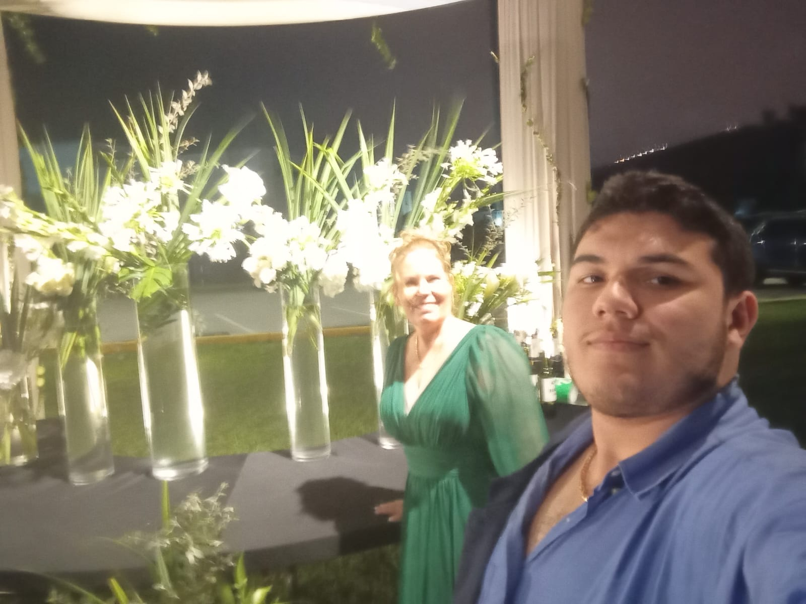
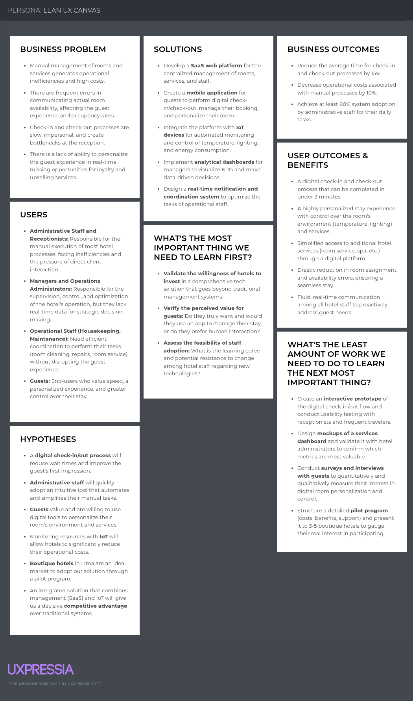

<div align="center">

# UNIVERSIDAD PERUANA DE CIENCIAS APLICADAS

<br><br>

## FACULTAD DE INGENIERÍA
### CARRERA DE INGENIERÍA DE SOFTWARE

**CURSO:** 1ASI0722 - Agile Project Management  
**CICLO:** 2026-20  
**SECCIÓN:** 9286  
**PROFESOR:** Rouillon Sixto César Elías  

# INFORME DE TRABAJO FINAL: ENTREGAS TB1 & TB2

### **Nombre de la Startup:** Sisifo
### **Nombre del Producto:** SmartStay

### **Relación de Integrantes:**

| Código de Estudiante | Apellidos y Nombres | Carrera |
| :--- | :--- | :--- |
| U20221E617 | Verona Flores Italo Sebastian | Ingeniería de Software |
| U20221A390 | Su Caletti Eddo | Ingeniería de Software |
| U202212214 | Oskar Rodrigo  Sosa Soto | Ingeniería de Software |
| U202224867 | Ever Giusephi  Carlos Lavado| Ingeniería de Software |
| U202218645| Augusto Sebastian  Montes Maza | Ingeniería de Software |

**Mes y Año:** Septiembre, 2026  
**Repositorio GitHub:** [Organización de Sisifo](https://github.com/sisifoGroup)

</div>

<div style="page-break-after: always;"></div>

# Registro de Versiones del Informe

El objetivo de esta sección es registrar y evidenciar las modificaciones, adiciones, correcciones o mejoras realizadas al informe durante el ciclo de vida del proyecto. Cada línea debe asociarse a un único autor y a commits concretos.

| Versión | Fecha | Autor | Descripción de Modificación |
| :---: | :---: | :--- | :--- |
| **1.0.0** | 11/09/2026 | Verona Flores Italo Sebastian | Creación de la estructura base del informe, carátula e integración del registro de versiones. |
| **1.0.1** | 11/09/2026 | Su Caletti Eddo | Elaboración del Startup Profile: descripción de la Startup y perfiles de Integrantes del Equipo. |
| **1.0.2** | 11/09/2026 | Oskar Rodrigo Sosa Soto | Documentación de los perfiles individuales de los integrantes y roles preliminares. |
| **1.0.3** | 11/09/2026 | Ever Giusephi Carlos Lavado | Formulación del Solution Profile: aplicación de técnica 5W2H y análisis del problema. |
| **1.0.4** | 11/09/2026 | Augusto Sebastian Montes Maza | Definición de la Propuesta de Valor y caracterización de Segmentos Objetivo. |
| **1.1.0** | 11/09/2026 | Verona Flores Italo Sebastian | Consolidación de los Objetivos SMART de los integrantes y tabla de Student Outcome. |
| **1.2.0** | 11/09/2026 | Verona Flores Italo Sebastian | Revisión final de estilo APA 7, validación cruzada y compilación para la entrega TB1. |
| **2.0.0** | 22/09/2026 | Verona Flores Italo Sebastian | Creación de la estructura base del Capítulo II: Gestión de Áreas de Conocimiento Agile e integración del Project Charter para TB2 (Semana 5). |
| **2.0.1** | 22/09/2026 | Su Caletti Eddo | Redacción de las Necesidades del Negocio, Justificación Comercial y Relación del Proyecto con la Necesidad Comercial. |
| **2.0.2** | 22/09/2026 | Oskar Rodrigo Sosa Soto | Elaboración de la Descripción del Proyecto (arquitectura macro) y catálogo de Características del Producto/Servicio. |
| **2.0.3** | 22/09/2026 | Ever Giusephi Carlos Lavado | Formulación de la Matriz de Eventos de Riesgo, Supuestos Críticos y Restricciones del Proyecto. |
| **2.0.4** | 22/09/2026 | Augusto Sebastian Montes Maza | Definición del esquema de Gobernanza, Autoridad Iniciadora, facultades del Project Manager y Matriz de Aprobaciones. |
| **2.1.0** | 22/09/2026 | Verona Flores Italo Sebastian | Consolidación integral del Project Charter, actualización de la Tabla de Contenidos y validación de estándares ágiles para TB2. |
| **2.1.1** | 27/09/2026 | Oskar Rodrigo Sosa Soto | Revisión de la Descripción del Proyecto y Características del Producto/Servicio: estandarización de la numeración de subsecciones (4.1.7.1) y ajuste de redacción. |

<div style="page-break-after: always;"></div>

# Tabla de Contenidos

1. [Student Outcome](#student-outcome)
2. [Objetivos SMART](#objetivos-smart)
3. [Capítulo I: Introducción](#capítulo-i-introducción)
   * 3.1. [Startup Profile](#31-startup-profile)
     * 3.1.1. [Descripción del Startup](#311-descripción-del-startup)
     * 3.1.2. [Perfiles de Integrantes del Equipo](#312-perfiles-de-integrantes-del-equipo)
   * 3.2. [Solution Profile](#32-solution-profile)
     * 3.2.1. [Nombre del Producto](#321-nombre-del-producto)
     * 3.2.2. [Antecedentes y Problemática (Técnica 5W2H)](#322-antecedentes-y-problemática-técnica-5w2h)
     * 3.2.3. [Lean UX Process](#323-lean-ux-process)
       * 3.2.3.1. [Lean UX Problem Statement](#3231-lean-ux-problem-statement)
       * 3.2.3.2. [Lean UX Assumptions](#3232-lean-ux-assumptions)
       * 3.2.3.3. [Lean UX Hypothesis](#3233-lean-ux-hypothesis)
       * 3.2.3.4. [Lean UX Canvas](#3234-lean-ux-canvas)
     * 3.2.4. [Propuesta de Valor](#324-propuesta-de-valor)
     * 3.2.5. [Segmentos Objetivo](#325-segmentos-objetivo)
4. [Capítulo II: Gestión de Áreas de Conocimiento Agile](#capítulo-ii-gestión-de-áreas-de-conocimiento-agile)
   * 4.1. [Agile Project Integration Management: Project Charter](#41-agile-project-integration-management-project-charter)
     * 4.1.1. [Resumen Ejecutivo](#411-resumen-ejecutivo)
     * 4.1.2. [Nombre del Proyecto](#412-nombre-del-proyecto)
     * 4.1.3. [Autoridades](#413-autoridades)
     * 4.1.4. [Autoridad Iniciadora](#414-autoridad-iniciadora)
     * 4.1.5. [Project Manager](#415-project-manager)
     * 4.1.6. [Necesidades del Negocio](#416-necesidades-del-negocio)
     * 4.1.7. [Descripción del Proyecto](#417-descripción-del-proyecto)
     * 4.1.8. [Características del Producto/Servicio](#418-características-del-productoservicio)
     * 4.1.9. [Relación del Proyecto con la Necesidad Comercial](#419-relación-del-proyecto-con-la-necesidad-comercial)
     * 4.1.10. [Supuestos](#4110-supuestos)
     * 4.1.11. [Restricciones](#4111-restricciones)
     * 4.1.12. [Eventos de Riesgo](#4112-eventos-de-riesgo)
     * 4.1.13. [Aprobaciones](#4113-aprobaciones)
5. [Bibliografía](#bibliografia)

<div style="page-break-after: always;"></div>

# Student Outcome

### ABET - EAC - Student Outcome 2:
> *La capacidad de aplicar el diseño de ingeniería para producir soluciones que satisfagan necesidades específicas con consideración de salud pública, seguridad y bienestar, así como factores globales, culturales, sociales, ambientales y económicos.*

En la siguiente tabla se describen las acciones individuales realizadas y las conclusiones grupales correspondientes a la entrega **TB1**:

| Criterio Específico | Acciones Realizadas (Por Integrante - TB1) | Conclusiones Grupales |
| :--- | :--- | :--- |
| **Criterio 1:**<br>Diseña productos o componentes en ingeniería de software que satisfacen necesidades específicas considerando el impacto en salud pública, seguridad y bienestar, así como factores globales, culturales, sociales, ambientales y económicos. | **Verona Flores, Italo Sebastian:**<br>• Participó en la identificación preliminar de los componentes básicos de la plataforma SmartStay, considerando la seguridad de la información de los usuarios y el confort en la gestión de hospedajes.<br><br>**Su Caletti Eddo**<br>• Colaboró en la descripción del problema de gestión hotelera evaluando el impacto económico en pequeños y medianos establecimientos y las descripcion de nuestro startup. <br> **TB2** <br>• Colabore en la parte de 4.1.9, 4.1.10 y 4.1.11 (Relación del Proyecto con la Necesidad Comercial, Supuestos y Restricciones) de nuestro trabajo <br><br>**Oskar Rodrigo  Sosa Soto**<br>• Apoyó en la formulación de la propuesta de valor orientada a mejorar la experiencia y bienestar de los huéspedes.<br><br>**Ever Giusephi  Carlos Lavado**<br>• Recopiló información sobre factores culturales y sociales en la interacción de usuarios y anfitriones.<br><br>**Augusto Sebastian Montes Maza**<br>• Revisó consideraciones básicas de accesibilidad digital y protección de datos para la solución inicial. | Durante esta fase inicial (TB1), el equipo definió conceptualmente la solución SmartStay y el alcance preliminar del servicio, asegurando que los requerimientos base contemplen la seguridad de la información de los huéspedes y la accesibilidad del usuario. |
| **Criterio 2:**<br>Diseña proyectos que permiten la implementación de soluciones en ingeniería de software considerando el impacto en salud pública, seguridad, bienestar, así como factores globales, culturales, sociales, ambientales y económicos. | **Verona Flores, Italo Sebastian:**<br>• Apoyó en la estructuración de los objetivos iniciales del proyecto SmartStay y en la identificación de los stakeholders clave.<br><br>**Su Caletti Eddo:**<br>• Participó en la delimitación de los antecedentes y el contexto del sector hotelero mediante la técnica 5W2H.<br> **TB2** <br>• Participacion en la elaboracion de la segunda entrega con 4.1.9, 4.1.10 y 4.1.11 en esta parte de la seccion dada con todo lo pedido. <br><br>**Oskar Rodrigo  Sosa Soto:**<br>• Colaboró en la definición preliminar de los segmentos objetivo (huéspedes y administradores de hospedajes).<br><br>**Ever Giusephi  Carlos Lavado:**<br>• Ayudó a mapear los riesgos y restricciones tempranas del entorno donde operará la solución.<br><br>**Augusto Sebastian Montes Maza:**<br>• Contribuyó en la definición de los canales de comunicación y coordinación inicial del equipo. | En este arranque, el equipo estructuró las bases del proyecto SmartStay aplicando técnicas de análisis del problema (5W2H) y alineando la planificación inicial con las necesidades operativas de los establecimientos de hospedaje. |
| **Criterio 3:**<br>Diseña y ejecuta los procesos relacionados al desarrollo y mantenimiento de la solución de software en ingeniería considerando el impacto en salud pública, seguridad, bienestar, así como factores globales, culturales, sociales, ambientales y económicos. | **Verona Flores, Italo Sebastian:**<br>• Colaboró en la configuración inicial del repositorio colaborativo en GitHub y en la adopción de las pautas de commits acordadas.<br><br>**Su Caletti Eddo :**<br>• Participó en la organización de la documentación del informe en formato Markdown respetando la estructura exigida. <br> **TB2** <br>•Participe en la organisacion y reparticion de cada parte de los integrantes del grupo junto con la elaboracion del mismo. <br><br>**Oskar Rodrigo  Sosa Soto:**<br>• Apoyó en la configuración del tablero de seguimiento de tareas en Trello para la distribución de actividades.<br><br>**Ever Giusephi  Carlos Lavado:**<br>• Ayudó a definir los acuerdos de equipo (*Working Agreements*) para el trabajo colaborativo en las iteraciones.<br><br>**Augusto Sebastian Montes Maza:**<br>• Estableció los canales sincrónicos y asincrónicos para coordinar las reuniones semanales de seguimiento. | Se implementaron los procesos de trabajo colaborativo base (control de versiones en GitHub, tablero ágil en Trello y canales de comunicación), garantizando orden, transparencia y trazabilidad en la documentación de esta primera entrega. |

<div style="page-break-after: always;"></div>

# Objetivos SMART

A continuación, cada miembro del equipo de trabajo formula un plan que incluye al menos **dos (2) objetivos SMART** orientados a su desarrollo y crecimiento profesional continuo una vez culminada la carrera universitaria:

### 1. Verona Flores, Italo Sebastian
* **Objetivo SMART 1 (Técnico / Especialización):**
  * *Específico (S):* Obtener la certificación oficial AWS Certified Solutions Architect – Associate y posteriormente la certificación Professional para consolidar competencias avanzadas en diseño de infraestructuras escalables en la nube.
  * *Medible (M):* Aprobar satisfactoriamente el examen de certificación Associate (con un puntaje mayor al 75%) y completar el roadmap de estudio para la certificación Professional en un plazo acumulado de 3 años.
  * *Alcanzable (A):* Destinar 8 horas semanales al estudio técnico especializado, realización de laboratorios prácticos en la consola de AWS y resolución de simuladores oficiales.
  * *Relevante (R):* Valida formalmente mis competencias técnicas en el mercado internacional, facilitando la postulación a roles senior y aportando valor directo en el diseño de arquitecturas robustas para proyectos propios o de terceros.
  * *Temporal (T):* Obtener la certificación Associate en los primeros 18 meses tras la graduación, y la certificación Professional en un plazo máximo de 3 años posteriores a la misma.

* **Objetivo SMART 2 (Desarrollo Profesional / Emprendimiento):**
  * *Específico (S):* Fundar y consolidar una startup tecnológica o consultoría de infraestructura independiente de modelo operativo 100% remoto, orientada al diseño y despliegue de soluciones en la nube.
  * *Medible (M):* Alcanzar un flujo de ingresos estables superior a los 15,000 soles mensuales y mantener una cartera activa de al menos 3 clientes recurrentes o proyectos propios escalados en producción.
  * *Alcanzable (A):* Validar el modelo de negocio y estructurar la oferta de servicios durante el último año de la carrera, apalancándome en redes profesionales y en las habilidades adquiridas en gestión ágil de proyectos.
  * *Relevante (R):* Permite alcanzar la autonomía financiera, la libertad técnica y la flexibilidad geográfica necesarias para consolidarme como referente en arquitectura de software y sostener mi desarrollo profesional continuo.
  * *Temporal (T):* En un plazo de 5 a 6 años contados a partir de la fecha de graduación profesional.

---

### 2. Su Caletti Eddo
* **Objetivo SMART 1 (Técnico / Especialización):**
  * *Específico (S):* Fortalecer mis competencias en desarrollo backend mediante el aprendizaje de Spring Boot y Java avanzado, y consolidar este conocimiento obteniendo la certificación internacional **Oracle Certified Professional: Java SE Developer**.
  * *Medible (M):* Desarrollar 2 proyectos académicos integrales con arquitectura REST API e integración a bases de datos relacionales, y aprobar el examen de certificación con una puntuación superior al 70%.
  * *Alcanzable (A):* Dedicar 6 horas semanales al estudio autodidacta, resolución de ejercicios prácticos en plataformas especializadas y la construcción progresiva del portafolio durante los próximos ciclos académicos.
  * *Relevante (R):* Garantiza el dominio de un estándar industrial altamente demandado en el desarrollo de software empresarial, respaldando formalmente mis habilidades técnicas antes de egresar.
  * *Temporal (T):* Completar la ruta de aprendizaje y obtener la certificación en un plazo máximo de 18 meses (al finalizar el 7.º ciclo).

* **Objetivo SMART 2 (Liderazgo / Desarrollo Profesional):**
  * *Específico (S):* Desarrollar habilidades de gestión de equipos y metodologías ágiles desempeñando el rol de *Scrum Master* o líder técnico en al menos dos proyectos académicos grupales de la carrera.
  * *Medible (M):* Implementar ceremonias ágiles (Sprint Planning, Daily Stand-ups, Retrospectivas) y mantener una tasa de cumplimiento de historias de usuario del 90% en los sprints planificados.
  * *Alcanzable (A):* Estudiar los marcos de trabajo Scrum y Kanban mediante recursos de Scrum.org y aplicar las herramientas de gestión (Jira/Trello) asignadas en los cursos de la especialidad.
  * *Relevante (R):* Desarrolla competencias transversales de liderazgo, comunicación y gestión de proyectos, fundamentales para la coordinación eficiente en equipos de desarrollo de software.
  * *Temporal (T):* Cumplir con la meta durante los próximos 12 meses (entre el 5.º y 6.º ciclo académico).
---

### 3. Oskar Rodrigo  Sosa Soto
* **Objetivo SMART 1 (Técnico / Especialización):**
  * *Específico (S):* Profundizar mis competencias en desarrollo full-stack y aseguramiento de calidad de software (QA), obteniendo una certificación internacional en testing (por ejemplo, ISTQB Foundation Level) que respalde formalmente mi capacidad de construir y verificar soluciones.
  * *Medible (M):* Completar al menos 3 proyectos integrales (web, móvil o IoT) que incluyan una suite de pruebas automatizadas con cobertura mayor al 70%, y aprobar el examen de certificación ISTQB.
  * *Alcanzable (A):* Dedicar 6 horas semanales al estudio de frameworks de testing (unitario, integración y end-to-end) y a la práctica de control de calidad sobre mis propios proyectos full-stack durante los próximos ciclos académicos.
  * *Relevante (R):* Consolida mi perfil dual de desarrollador y verificador, un enfoque muy valorado en la industria para reducir errores en producción y mejorar la confiabilidad de los productos que construyo.
  * *Temporal (T):* Obtener la certificación y completar el portafolio de proyectos en un plazo máximo de 18 meses (al finalizar el 7.º ciclo).

* **Objetivo SMART 2 (Desarrollo Profesional / Especialización en IoT):**
  * *Específico (S):* Especializarme en el desarrollo de soluciones IoT integradas a aplicaciones móviles y backends escalables, liderando o participando activamente en un proyecto real que conecte dispositivos físicos con una plataforma digital.
  * *Medible (M):* Diseñar e implementar al menos 1 proyecto IoT funcional de extremo a extremo (sensor/dispositivo, backend y app móvil) y presentarlo como parte de mi portafolio profesional.
  * *Alcanzable (A):* Aplicar los conocimientos adquiridos en cursos de la carrera y recursos autodidactas sobre microcontroladores, protocolos de comunicación (MQTT/HTTP) y desarrollo móvil, dedicando tiempo constante durante los ciclos restantes.
  * *Relevante (R):* Amplía mi rango de acción como ingeniero de software hacia productos híbridos hardware-software, aumentando mi empleabilidad en sectores con alta demanda de soluciones conectadas.
  * *Temporal (T):* Culminar el proyecto IoT integral en un plazo de 2 años, antes de finalizar la  carrera universitaria.

---

### 4. Ever Giusephi  Carlos Lavado
* **Objetivo SMART 1:**
  * S (Specific): Mejorar mis conocimientos y habilidades prácticas en desarrollo de aplicaciones web.
  * M (Measurable): Completar al menos 2 proyectos funcionales aplicando tecnologías y buenas prácticas de desarrollo.
  * A (Achievable): Dedicar al menos 4 horas semanales al aprendizaje y desarrollo práctico.
  * R (Relevant): Fortalecer mis competencias técnicas necesarias para mi formación como ingeniero de software.
  * T (Time-bound): Alcanzarlo al finalizar el presente ciclo académico.

* **Objetivo SMART 2:**
  * S (Specific): Mejorar la planificación y organización de mis actividades académicas y proyectos.
  * M (Measurable): Cumplir al menos con el 90 % de mis tareas y entregables antes de sus fechas límite.
  * A (Achievable): Utilizar semanalmente herramientas de planificación y establecer prioridades para cada actividad.
  * R (Relevant): Mejorar mi productividad y cumplimiento de responsabilidades dentro de los equipos de trabajo.
  * T (Time-bound): Mantener este nivel de cumplimiento durante todo el presente ciclo académico.

---

### 5. Augusto Sebastian Montes Maza
* **Objetivo SMART 1 (Técnico / Especialización):**
  * *Específico (S):* Especializarme en el desarrollo backend y la arquitectura de aplicaciones escalables, fortaleciendo mis conocimientos en .NET, Java, APIs REST, bases de datos y tecnologías cloud.
  * *Medible (M):* Desarrollar al menos 3 proyectos backend funcionales, implementando autenticación, conexión con bases de datos, documentación mediante Swagger y despliegue en la nube. Además, completar una certificación relacionada con desarrollo o arquitectura cloud.
  * *Alcanzable (A):* Dedicar 6 horas semanales al estudio autodidacta, la realización de cursos especializados y la construcción progresiva de un portafolio técnico utilizando proyectos académicos y personales.
  * *Relevante (R):* Permitirá consolidar mis competencias como ingeniero de software y mejorar mi preparación para asumir oportunidades laborales en desarrollo backend, integración de sistemas y arquitectura cloud.
  * *Temporal (T):* Completar los proyectos y obtener la certificación en un plazo máximo de 18 meses, antes de culminar la carrera universitaria.

* **Objetivo SMART 2 (Desarrollo Profesional / Empleabilidad):**
  * *Específico (S):* Incorporarme al mercado laboral como ingeniero de software, participando en proyectos profesionales donde pueda aplicar mis conocimientos de desarrollo, bases de datos, metodologías ágiles y trabajo en equipo.
  * *Medible (M):* Conseguir una posición de practicante o desarrollador junior, participar en al menos 2 proyectos profesionales y mantener un portafolio actualizado con mínimo 5 proyectos documentados en GitHub.
  * *Alcanzable (A):* Mejorar continuamente mi currículum, perfil de LinkedIn y habilidades técnicas, además de prepararme para entrevistas mediante ejercicios de programación y postulaciones constantes a oportunidades laborales.
  * *Relevante (R):* Facilitará mi transición de la etapa universitaria al ámbito profesional, permitiéndome adquirir experiencia real, ampliar mi red de contactos y desarrollar una trayectoria sólida en ingeniería de software.
  * *Temporal (T):* Obtener la primera oportunidad laboral relacionada con mi carrera durante los 12 meses posteriores a mi graduación y consolidar mi experiencia profesional en un plazo máximo de 3 años.


<div style="page-break-after: always;"></div>

# Capítulo I: Introducción

## 3.1. Startup Profile

### 3.1.1. Descripción de la Startup

* **Nombre de la Startup:** SmartStay  
* **Misión:** Impulsar la transformación digital del sector hotelero boutique mediante soluciones de software ágiles e intuitivas que centralizan y automatizan la gestión del personal operativo, eliminando fricciones logísticas y garantizando un servicio de hospitalidad accesible y de alta calidad.  
* **Visión:** Consolidarse en los próximos 3 a 5 años como el sistema estándar de optimización operativa para hoteles independientes a nivel regional e internacional, siendo reconocidos por convertir la complejidad logística en flujos de trabajo transparentes, eficientes y altamente escalables.  
* **Valores y Cultura de Trabajo:**  
  * *Transparencia:* Comunicación abierta y visibilidad total en las tareas mediante tableros de seguimiento y ceremonias ágiles (Scrum/Kanban), asegurando la trazabilidad de los avances.  
  * *Adaptabilidad:* Capacidad iterativa ante cambios de contexto o requerimientos de los usuarios finales, refinando continuamente la solución **RapiFast**.  
  * *Excelencia Técnica:* Compromiso con la calidad del código, prácticas de prueba y una arquitectura de software limpia y escalable.  
  * *Colaboración e Inclusión:* Fomento del trabajo multidisciplinario, aprovechando la diversidad de perfiles técnicos del equipo y respetando las perspectivas de cada integrante.

---

### 3.1.2. Perfiles de Integrantes del Equipo

#### Integrante 1: Su Caletti Eddo
* **Fotografía:**  
  
* **Código de Estudiante:** U20221A390
* **Carrera:** Ingeniería de Software
* **Breve Descripción de Experiencia:**  
  Estudiante del cuarto ciclo de Ingeniería de Software en la Universidad Peruana de Ciencias Aplicadas (UPC). Posee bases sólidas en programación orientada a objetos, diseño de algoritmos y modelado de bases de datos relacionales. Cuenta con experiencia en proyectos académicos aplicando buenas prácticas de desarrollo web, control de versiones y estructuración de documentación técnica de software.
* **Principales Habilidades que Aporta al Equipo:**  
  * *Conocimientos Técnicos:* Programación Orientada a Objetos (C++ / Java), diseño de bases de datos SQL, control de versiones con Git y GitHub, y documentación técnica.
  * *Habilidades Blandas:* Ejecución práctica y orientada a resultados, resolución lógica de problemas, alta capacidad de aprendizaje e integración en equipo, responsabilidad y comunicación clara.

---

#### Integrante 2: Oskar Rodrigo Sosa Soto
* **Fotografía:**  
  
* **Código de Estudiante:** U202212214
* **Carrera:** Ingeniería de Software
* **Breve Descripción de Experiencia:**  
  I am a Software Engineering student at Universidad Peruana de Ciencias Aplicadas (UPC) focused on building useful, reliable and maintainable digital products. My experience combines full-stack development, mobile applications, IoT solutions and software quality assurance. I have participated in academic, personal and real-world projects covering frontend interfaces, backend services, databases, authentication, testing, documentation and collaborative delivery with Git and Scrum. I enjoy understanding a product from two complementary perspectives: how to build it correctly and how to verify that it works correctly.
* **Principales Habilidades que Aporta al Equipo:**  
  * *Conocimientos Técnicos:* Desarrollo full-stack (frontend y backend), aplicaciones móviles, soluciones IoT, bases de datos y autenticación, aseguramiento de calidad de software (QA/testing), y control de versiones con Git.
  * *Habilidades Blandas:* Pensamiento analítico para construir y verificar soluciones desde ambas perspectivas, colaboración efectiva en equipos ágiles (Scrum) y comunicación clara en la documentación técnica.

---

#### Integrante 3: Italo Sebastian Verona Flores
* **Fotografía:**  
  
* **Código de Estudiante:** U20221E617
* **Carrera:** Ingeniería de Software
* **Breve Descripción de Experiencia:**  
  Participación en proyectos académicos de desarrollo de software, desempeñando funciones de desarrollo Frontend y participando en el diseño e implementación de soluciones web y móviles. Experiencia trabajando con metodologías ágiles y equipos multidisciplinarios.
* **Principales Habilidades que Aporta al Equipo:**  
  * **Conocimientos Técnicos:** C#, Java, JavaScript, TypeScript, Dart, Angular, Vue.js, Flutter, HTML5, CSS3, MySQL, SQL Server, MongoDB, Git y GitHub.
  * **Habilidades Blandas:** Pensamiento analítico, resolución de problemas, aprendizaje autónomo, trabajo en equipo, comunicación y gestión del tiempo.

---

#### Integrante 4: Ever Giusephi Carlos Lavado
* **Fotografía:**  
  
* **Código de Estudiante:** U202224867
* **Carrera:** Ingeniería de Software
* **Breve Descripción de Experiencia:**  
  Estudiante de Ingeniería de Software con experiencia académica en el desarrollo de aplicaciones web, gestión de proyectos de software y trabajo colaborativo mediante metodologías ágiles. Familiarizado con el desarrollo frontend, control de versiones y documentación de proyectos.
* **Principales Habilidades que Aporta al Equipo:**  
  * *Conocimientos Técnicos:* Desarrollo web, Vue.js, JavaScript, HTML, CSS, Git, GitHub, bases de datos y documentación técnica.
  * *Habilidades Blandas:* Organización, responsabilidad, trabajo en equipo, comunicación efectiva, adaptabilidad y resolución de problemas.

---

#### Integrante 5: Augusto Sebastian Montes Maza
* **Fotografía:**  
  
* **Código de Estudiante:** U202218645
* **Carrera:** Ingeniería de Software
* **Breve Descripción de Experiencia:**  
  Estudiante de Ingeniería de Software en la Universidad Peruana de Ciencias Aplicadas (UPC), con experiencia académica en el desarrollo de aplicaciones web, APIs REST y sistemas backend utilizando tecnologías como C#, .NET, Java, PHP y SQL Server. Ha participado en proyectos de software aplicando programación orientada a objetos, diseño de bases de datos, arquitectura de microservicios, metodologías ágiles y control de versiones con Git y GitHub. Asimismo, cuenta con experiencia en atención y comunicación con público estadounidense, fortaleciendo sus habilidades de adaptación y comunicación intercultural.
* **Principales Habilidades que Aporta al Equipo:**  
  * *Conocimientos Técnicos:* Desarrollo backend, C#, .NET, Java, PHP, APIs REST, SQL Server, diseño de bases de datos, arquitectura de microservicios, Swagger, Git, GitHub y documentación técnica.
  * *Habilidades Blandas:* Pensamiento analítico, resolución de problemas, responsabilidad, organización, comunicación efectiva, trabajo colaborativo, adaptabilidad y comunicación intercultural.

---

## 3.2. Solution Profile

### 3.2.1. Nombre del Producto

**SmartStay**

SmartStay es una plataforma de gestión operativa inteligente diseñada específicamente para el sector hotelero boutique. El producto se define como un sistema centralizado que optimiza la coordinación de tareas críticas mediante una arquitectura robusta y escalable, permitiendo al Staff Operativo gestionar solicitudes, estados de habitación y mantenimiento con alta disponibilidad y eficiencia en tiempo real.

---

### 3.2.2. Antecedentes y Problemática (Técnica 5W2H)

Para fundamentar el diseño de la arquitectura de SmartStay, se aplica la técnica de las **5W2H**. Este análisis permite identificar los *Architectural Drivers* (Atributos de Calidad) necesarios para resolver las deficiencias del sistema actual.

* **Who? (¿Quiénes?):**  
  El problema impacta directamente al Staff Operativo (término que integra tanto a los administradores como al personal de limpieza, mantenimiento y recepción) de hoteles boutique. Asimismo, afecta a los huéspedes, quienes demandan una experiencia personalizada y autónoma que la infraestructura actual no puede soportar de manera eficiente.
* **What? (¿Qué?):**  
  El problema central es la carencia de automatización y digitalización en la gestión hotelera integral. Desde una perspectiva de arquitectura, existe una falta de interoperabilidad y procesamiento en tiempo real de los datos, lo que resulta en una gestión de inventarios y servicios manual y propensa a errores.
* **Where? (¿Dónde?):**  
  La problemática es omnipresente en el ecosistema hotelero: desde los módulos administrativos y de recepción hasta las áreas de servicio y las habitaciones. La falta de un sistema centralizado impide que el Staff Operativo tenga visibilidad total de las operaciones en todas las áreas físicas del establecimiento.
* **When? (¿Cuándo?):**  
  Ocurre de forma ininterrumpida (24/7). Sin embargo, se vuelve crítica durante los picos de check-in/check-out y temporadas de alta ocupación, donde los sistemas tradicionales fallan al intentar escalar ante múltiples solicitudes simultáneas de servicios por parte de los huéspedes.
* **Why? (¿Por qué?):**  
  El origen técnico radica en la dependencia de arquitecturas monolíticas o sistemas aislados que no permiten la integración de nuevas tecnologías. La falta de un diseño basado en Domain-Driven Design (DDD) ha generado una lógica de negocio acoplada que impide la actualización independiente de módulos y la implementación de soluciones IoT para el monitoreo en tiempo real.
* **How? (¿Cómo?):**  
  El Staff Operativo debe realizar tareas manuales redundantes, como verificar disponibilidad física de habitaciones o coordinar servicios vía radio o papel. Sin una arquitectura de microservicios orientada a eventos, la sincronización entre el pedido de un huésped y la ejecución de la tarea por parte del personal es lenta y carece de trazabilidad.
* **How Much? (¿Cuánto?):**  
  Estas ineficiencias arquitectónicas se traducen en una pérdida de productividad estimada entre el 15% y 20%. Además, genera un incremento significativo en costos operativos (energía y suministros) y una degradación en la satisfacción del cliente, lo que impacta negativamente en la reputación digital y el valor del negocio a largo plazo.

---

### 3.2.3. Lean UX Process

#### 3.2.3.1. Lean UX Problem Statement

**Problem Statement: Fragmentación del Servicio y Experiencia del Huésped**

El actual servicio de gestión hotelera en el segmento boutique presenta una fragmentación operativa que impide el cumplimiento de los estándares de hospitalidad modernos. Hemos observado que tanto el Staff Operativo (administradores y personal de campo) como los huéspedes enfrentan un factor crítico: la gestión manual y analógica genera cuellos de botella informáticos, errores de disponibilidad y una incapacidad técnica para ofrecer personalización en tiempo real.

Para los huéspedes, la falta de canales digitales autónomos se traduce en tiempos de espera excesivos para trámites básicos como el check-in/check-out y una dependencia total del personal para solicitar servicios de habitación o reportar incidencias. Esta desconexión tecnológica degrada la percepción de confort y modernidad que el hotel busca proyectar.

Desde el punto de vista arquitectónico, los sistemas actuales no permiten una sincronización distribuida. Esto obliga al personal a trabajar a ciegas y al huésped a permanecer pasivo, careciendo ambos de una plataforma centralizada con capacidades de respuesta inmediata y monitoreo proactivo.

> ¿Cómo podríamos diseñar una arquitectura digital que automatice la gestión operativa para el Staff Operativo y, simultáneamente, empodere al huésped con herramientas de autoservicio, reduciendo errores y elevando la calidad de la experiencia personalizada?

**Features**
* Gestión Centralizada de Habitaciones: Visualización en tiempo real del inventario y actualización de estados (disponible, ocupada, limpieza, mantenimiento) para el control administrativo.
* Asignación y Registro Digital: Automatización de la asignación de habitaciones según disponibilidad y gestión de procesos de check-in/check-out digitales.
* Módulo de Housekeeping (Limpieza): Programación dinámica de tareas de limpieza con registro de avance por parte del personal operativo y notificaciones de estado.
* Coordinación de Mantenimiento: Sistema de tickets para el registro, asignación y seguimiento de incidencias reportadas por el personal o los huéspedes.
* Dashboard de Staff Operativo (Administradores): Panel de control analítico para la gestión de recursos, personal y supervisión general de la operación hotelera.
* Portal de Autoservicio para Huéspedes: Interfaz digital para solicitar servicios (amenities, asistencia), consultar estados de cuenta y personalizar su estancia.
* Sistema de Notificaciones Event-Driven: Alertas inmediatas para el personal (limpieza/mantenimiento) y notificaciones de servicio para los huéspedes mediante una arquitectura de eventos.
* Seguridad y Gestión de Roles: Control de acceso granular para diferenciar funciones entre administradores, personal operativo y huéspedes, asegurando la integridad de los datos.

**Business Outcomes**
* *Objetivo (O):* Mejorar la eficiencia operativa del establecimiento hotelero en un ciclo inicial de 4 meses.
* *Key Results (KR):*
  * Reducir en un 15% el tiempo promedio de procesamiento de check-in y check-out mediante la automatización de procesos.
  * Disminuir en un 10% los costos operativos derivados de errores en procesos manuales y redundancia de tareas.
  * Alcanzar un 80% de adopción activa del sistema por parte del Staff Operativo en la gestión de sus actividades diarias.

**User Outcomes**
* *Objetivo (O):* Brindar una experiencia de gestión ágil, transparente y autónoma tanto para huéspedes como para el personal.
* *Key Results (KR):*
  * Lograr que los huéspedes completen su registro digital de manera autónoma en menos de 3 minutos.
  * Obtener una calificación de satisfacción de usuario (NPS) de al menos 8/10 respecto a la nueva experiencia digital.
  * Asegurar que el 70% de los usuarios recurrentes utilicen las funciones de autoservicio sin requerir asistencia presencial del personal.

---

#### 3.2.3.2. Lean UX Assumptions

**Business Assumptions**
* **Creo que mis clientes necesitan:** Una solución centralizada para la gestión hotelera que elimine la dependencia de procesos manuales, optimice la comunicación interna y mejore la experiencia del huésped a través de la automatización de servicios.
* **Estas necesidades se pueden resolver con:** Una plataforma de gestión operativa que integre la supervisión administrativa, la ejecución de tareas de campo y la interacción directa del huésped en un único ecosistema digital de respuesta inmediata.
* **Mis clientes iniciales son (o serán):** Hoteles boutique y de mediana escala en zonas turísticas de Lima, que buscan diferenciarse mediante la modernización de su servicio y la eficiencia de su personal.
* **El valor #1 que un cliente quiere de mi servicio es:** La visibilidad total y en tiempo real de la operación hotelera, permitiendo una toma de decisiones ágil y una reducción drástica de errores en la atención al cliente.
* **El cliente también puede obtener estos beneficios adicionales:**
  * Optimización en el uso de insumos y recursos operativos.
  * Reducción de tiempos de espera en procesos de recepción y servicios.
  * Mejora en la reputación digital basada en la satisfacción del huésped.
  * Trazabilidad completa del desempeño del personal.
* **Voy a adquirir la mayoría de mis clientes a través de:** Venta directa consultiva, alianzas con gremios hoteleros locales y demostraciones de impacto en la eficiencia operativa.
* **Haré dinero a través de:** Un modelo de suscripción basado en el volumen de habitaciones gestionadas y niveles de servicio contratados.
* **Mi competencia principal en el mercado será:** Sistemas de gestión hotelera tradicionales que carecen de módulos de interacción directa con el huésped y herramientas de coordinación en tiempo real para el personal de campo.
* **Los venceremos debido a:** Nuestra capacidad de unificar la gestión administrativa y operativa con la experiencia del usuario final (huésped) en una sola interfaz fluida y sin fricciones.
* **Mi mayor riesgo de producto es:** La resistencia al cambio por parte de los establecimientos con procesos muy arraigados a lo análogo y la percepción de complejidad en la adopción de nuevas herramientas.
* **Resolveremos esto a través de:**
  * Una interfaz extremadamente intuitiva que no requiera capacitación técnica avanzada.
  * Implementaciones modulares que permitan al hotel adoptar la solución de forma progresiva.
  * Acompañamiento estratégico durante el despliegue inicial.
* **¿Qué otras suposiciones tenemos que, si se prueba que es falso, causará que nuestro negocio/proyecto no funcione?**
  * El Staff Operativo está dispuesto a reemplazar las comunicaciones por radio o papel por herramientas digitales.
  * Los huéspedes valoran la autonomía digital por encima de la interacción humana tradicional en hoteles boutique.
  * La infraestructura de conectividad de los hoteles es estable para soportar operaciones en tiempo real.

**User Assumptions**
* **¿Quién es el usuario?**  
  El Staff Operativo (que incluye a los administradores responsables de la supervisión y al personal de recepción, limpieza y mantenimiento) y los Huéspedes que buscan una estancia moderna y eficiente.
* **¿Dónde encaja nuestro producto en su trabajo o vida?**  
  Para el Staff Operativo, es la herramienta central de trabajo que organiza su jornada y facilita la comunicación. Para los Huéspedes, es el canal principal para gestionar su estancia y solicitudes sin intermediarios innecesarios.
* **¿Qué problemas tiene nuestro producto y cómo se puede resolver?**  
  El principal desafío es la fragmentación de la información. Se resuelve consolidando estados de habitaciones, requerimientos de mantenimiento y pedidos de huéspedes en un flujo de datos sincronizado y accesible según el rol del usuario.
* **¿Cuándo y cómo es usado nuestro producto?**  
  Se usa de manera continua durante toda la jornada operativa: desde la planificación de limpieza matutina, la gestión de ingresos y salidas al mediodía, hasta la atención de solicitudes especiales durante la noche.
* **¿Qué características son importantes?**
  * Actualización de estados en tiempo real.
  * Sistema de gestión de tickets y tareas asignadas.
  * Interfaz de autoservicio para el huésped.
  * Panel de indicadores para la toma de decisiones administrativa.
* **¿Cómo debe verse nuestro producto y cómo debe comportarse?**  
  Debe ser ágil y confiable. La interfaz debe priorizar la claridad sobre el adorno, asegurando que un administrador pueda identificar cuellos de botella de un vistazo y que el personal de limpieza pueda actualizar su progreso con un solo toque.

---

#### 3.2.3.3. Lean UX Hypothesis

**Hypothesis 1: Digital Check-in/Check-out Efficiency**  
We believe that implementing an automated digital registration and departure flow for Guests and Staff Operativo will reduce the average processing time for these operations by 15%.  
We'll know this is true when we see that guests complete their digital registration in less than 3 minutes and at least 70% of them use the digital system autonomously without requiring physical assistance.

**Hypothesis 2: Operational Staff Platform Adoption**  
We believe that providing a centralized management platform for the Staff Operativo (including administrators and field personnel) will achieve at least 80% adoption of the system for daily task coordination.  
We'll know this is true when we see consistent daily usage of the platform for room status updates and a 10% reduction in manual operational costs after four months of implementation.

**Hypothesis 3: Real-Time Operational Coordination**  
We believe that enabling real-time synchronization of room statuses and maintenance requests for the Staff Operativo will significantly decrease coordination errors and internal response times.  
We'll know this is true when we see an internal staff satisfaction score (NPS) of at least 8/10 and a 20% improvement in the speed of task completion compared to traditional manual methods.

**Hypothesis 4: Smart Resource Optimization**  
We believe that automating the monitoring of room environments and energy consumption for Hotel Administrators (within the Staff Operativo) will optimize the establishment's overall resource usage.  
We'll know this is true when we see a 20% reduction in monthly utility expenses and the generation of automated consumption reports that allow for proactive resource control.

**Hypothesis 5: Guest Experience Personalization**  
We believe that empowering Guests with direct digital control over their room environment and service scheduling will increase their overall satisfaction and the consumption of additional amenities.  
We'll know this is true when we see a 25% increase in satisfaction ratings in post-stay surveys and a 15% growth in room service and optional amenity orders.

**Hypothesis 6: Pilot Program Validation**  
We believe that offering a scalable and modular implementation model for boutique hotels in Lima will generate the necessary interest to validate our business model.  
We'll know this is true when we see the participation of at least three hotels in our initial pilot program with signed collaboration agreements for post-development testing.

**Hypothesis 7: Strategic Competitive Advantage**  
We believe that integrating operational management with smart automation features for both Staff Operativo and Guests will provide a superior value proposition compared to traditional, siloed legacy systems.  
We'll know this is true when we see that pilot hotels report improved operational visibility and express a clear preference for our solution over legacy alternatives or manual processes.

---

#### 3.2.3.4. Lean UX Canvas



---

### 3.2.4. Propuesta de Valor

La propuesta de valor representa el conjunto de beneficios tangibles e intangibles que nuestra solución ofrece a los clientes y usuarios para resolver los puntos de dolor detectados:

* **Descripción del Problema a Resolver:**  
  La gestión operativa de hoteles pequeños y boutique en Lima Metropolitana se encuentra altamente fragmentada debido a la dependencia de bitácoras físicas, registros manuales y canales de mensajería informal para coordinar la recepción, limpieza (*housekeeping*) y mantenimiento. Esta falta de sincronización en tiempo real produce retrasos en la rotación de habitaciones, errores en el estado de disponibilidad y una merma de entre el 15% y 20% en la productividad del personal. En paralelo, los huéspedes experimentan fricciones y tiempos de espera innecesarios al carecer de canales digitales autónomos para gestionar su llegada, salida y requerimientos durante la estancia.

* **Posibles Usuarios:**  
  * *Staff Operativo:* Personal de recepción, supervisores de limpieza (*housekeeping*), técnicos de mantenimiento y coordinadores de servicios.
  * *Administradores y Gerentes de Hotel:* Responsables de supervisar la productividad, asignación de recursos y métricas de desempeño del establecimiento.
  * *Huéspedes (Usuarios Finales):* Viajeros nacionales (de negocios y turismo urbano) y turistas internacionales que priorizan la autonomía, la inmediatez y el autoservicio digital durante su hospedaje.

* **Objetivos Esperados por parte del Startup:**  
  1. Captar el 12% del segmento objetivo de hoteles boutique y pequeños en Lima Metropolitana durante el primer año de lanzamiento comercial.
  2. Reducir en un 45% el tiempo promedio de coordinación interna y actualización del estado de habitaciones entre recepción, limpieza y mantenimiento.
  3. Validar el ajuste producto-mercado (*Product-Market Fit*) mediante iteraciones ágiles basadas en Lean UX, alcanzando un índice de satisfacción del cliente (*CSAT*) superior al 85% y una tasa de retención mensual (*churn* menor al 5%) en establecimientos afiliados.

* **Beneficios a Obtener por parte de los Usuarios (Value Proposition Canvas / Lean UX):**
  * *Creadores de Alegrías (Gain Creators):* Actualización en tiempo real del estado de cada habitación con trazabilidad operativa clara; interfaz intuitiva diseñada para minimizar la curva de aprendizaje del personal; experiencia de autoservicio para el huésped (check-in/check-out ágil y control de servicios desde su smartphone); y generación automática de reportes de desempeño para la administración.
  * *Aliviadores de Frustraciones (Pain Relievers):* Eliminación total de bitácoras en papel y comunicación verbal desorganizada; erradicación de discrepancias sobre la disponibilidad real de habitaciones; reducción drástica de tiempos de espera en el mostrador de recepción; y centralización de los flujos de trabajo en una infraestructura segura y sincronizada en la nube.
  * *Productos y Servicios:* Plataforma integral de gestión hotelera y experiencia del huésped conformada por:
    * Aplicación móvil nativa en Android para la asignación, ejecución y monitoreo de tareas del staff operativo.
    * Aplicación móvil multiplataforma (Flutter) orientada al huésped para autoservicio, solicitudes e interacción con comodidades del hotel.
    * Panel web administrativo centralizado, respaldado por una arquitectura modular de microservicios en la nube escalable y segura.

---

### 3.2.5. Segmentos Objetivo

A continuación se definen los segmentos de clientes asociados al dominio del problema, sustentados con características demográficas, psicográficas y datos estadísticos pertinentes:

#### Segmento 1: Staff Operativo de Hoteles Boutique y Pequeños en Lima
* **Criterios Demográficos / Profesionales:**
  * *Roles Incluidos:* Personal de recepción, supervisores de limpieza (housekeeping), técnicos de mantenimiento y coordinadores de servicios.
  * *Edad:* Entre 25 y 45 años.
  * *Nivel de Instrucción:* Técnico o universitario en turismo, hotelería, mantenimiento industrial o administración.
  * *Ubicación Geográfica:* Lima Metropolitana, Perú.
* **Criterios Psicográficos y Conductuales:**
  * Usuarios habituales de smartphones con sistema operativo Android; familiarizados con herramientas de mensajería y gestión de tareas básicas.
  * Experimentan alta fricción operativa debido a la dependencia de bitácoras físicas y comunicación verbal para actualizar el estado de las habitaciones.
  * Afectados por la fragmentación de información y la sobrecarga administrativa al coordinar entre áreas, buscando inmediatez y centralización en tiempo real.
* **Información Estadística de Sustento:**  
  * En Lima Metropolitana existen más de 300 hoteles pequeños y boutique (de 20 a 100 habitaciones) que operan con procesos manuales en áreas de servicios y mantenimiento.
  * La ineficiencia operativa en este segmento representa pérdidas de entre el 15% y 20% en la productividad del personal debido a fallos en la coordinación interna.

#### Segmento 2: Huéspedes de Hoteles (Usuarios Finales)
* **Criterios Demográficos:**
  * *Edad:* Entre 25 y 50 años (predominancia de Millennials y Generación X).
  * *Nivel Socioeconómico (NSE):* Medio-alto a alto (NSE A y B).
  * *Procedencia:* Viajeros nacionales (60%, enfocados en viajes de negocios o experiencias urbanas) y turistas internacionales (40%, procedentes de EE. UU., Europa y Latinoamérica).
* **Criterios Psicográficos y Conductuales:**
  * Perfil *digital-first*: emplean su smartphone personal como herramienta única para gestionar toda la experiencia de viaje.
  * Demanda de autonomía: alta disposición al autoservicio digital (check-in/check-out sin contacto y gestión de requerimientos a la habitación).
  * Interés en tecnologías IoT: valoran el control de ambientes (iluminación, climatización) desde el móvil, asociándolo a confort y exclusividad.
  * Altas expectativas de conectividad, requiriendo redes Wi-Fi de alta velocidad y canales de soporte directo e inmediato.
* **Información Estadística de Sustento:**  
  * El 68% de los huéspedes dentro de este perfil selecciona su hospedaje considerando la reputación digital del establecimiento y la disponibilidad de facilidades tecnológicas durante su estancia.
    
---

# Capítulo II: Gestión de Áreas de Conocimiento Agile

## 4.1. Agile Project Integration Management: Project Charter

El **Project Charter** (Acta de Constitución del Proyecto) constituye el documento fundacional formal que autoriza oficialmente el inicio del proyecto **SmartStay** dentro del marco de trabajo ágil de la startup **Sísifo**, otorgando al equipo de ingeniería y al Project Manager la autoridad para planificar, comprometer recursos y ejecutar los Sprints sucesivos.

---

### 4.1.1. Resumen Ejecutivo

El proyecto **Sísifo** surge como una solución tecnológica integral orientada a resolver la brecha de digitalización y las ineficiencias en la gestión operativa y de reservas del sector hotelero independiente (hoteles boutique y de mediana escala de entre 20 y 100 habitaciones). El diagnóstico del sector en Lima y Latinoamérica evidencia un desafío crítico de competitividad originado por la fragmentación operativa y la dependencia de bitácoras manuales o herramientas aisladas. Esta falta de integración se traduce en errores de disponibilidad (*overbooking*), demoras en el flujo de recepción y atención al cliente, descoordinación en las labores de servicio y una limitada visibilidad sobre los estados de facturación y métricas clave del negocio.

Para transformar la gestión operativa de estos establecimientos, Sísifo se concibe como **SmartStay**, una solución web centralizada soportada por una **arquitectura monolítica organizada por capas**. Esta estructura técnica garantiza alta cohesión, consistencia de datos, simplicidad de despliegue y un mantenimiento ágil a través de la siguiente distribución:

1. **Capa de Presentación (Frontend Web):** Interfaz desarrollada mediante *single-page applications* (SPA) con marcos de trabajo modernos (como Angular o Vue.js). Esta capa ofrece un Panel Web Administrativo unificado e intuitivo diseñado con vistas adaptativas según el rol de usuario:
   * **Para el huésped:** Permite la consulta interactiva de inventario en tiempo real, registro de datos de ingreso (*check-in/out* digital express) y autogestión de reservas.
   * **Para el personal administrativo y de recepción:** Proporciona un entorno centralizado para la asignación dinámica de habitaciones, control operativo de limpieza/mantenimiento mediante tableros de tareas sincronizados, y la visualización de analítica gerencial (indicadores clave como RevPAR, ADR y ocupación promedio).

2. **Capa de Lógica de Negocio (Backend):** Núcleo del sistema encargado de procesar y orquestar las reglas del dominio de la aplicación. Gestiona el motor de reservas en tiempo real, las reglas de facturación y cobros, los permisos de control de acceso basados en roles (RBAC) y la sincronización del catálogo e inventario de habitaciones.

3. **Capa de Acceso a Datos (Persistencia):** Responsable de administrar el mapeo objeto-relacional (ORM), ejecutar las transacciones y asegurar la persistencia con la base de datos relacional del sistema, garantizando la integridad referencial y el aislamiento de las operaciones concurrentes de reserva y facturación.

Gracias a este enfoque técnico centralizado y por capas, SmartStay elimina la dispersión de datos y optimiza los flujos de trabajo operativos sin elevar la complejidad de la infraestructura. La plataforma busca reducir los costos operativos hoteleros entre un 12% y un 15%, incrementar el rendimiento financiero del negocio (elevando el RevPAR hasta en un 10%) y mejorar sustancialmente el índice de satisfacción del huésped.

---

### 4.1.2. Nombre del Proyecto

* **Nombre Oficial del Proyecto:** *SmartStay: Intelligent Hospitality Operations & Guest Experience Platform*
* **Startup:** Sísifo (`sisifoGroup`)

---

### 4.1.3. Autoridades

La gobernanza de **SmartStay**, desarrollado por el equipo **Sísifo**, establece las responsabilidades y facultades necesarias para orientar el proyecto, coordinar el trabajo y resolver las decisiones que afectan su ejecución.

La organización responde a dos compromisos: desarrollar una propuesta que atienda las necesidades de los hoteles boutique y pequeños de Lima Metropolitana y cumplir con los objetivos académicos del curso de **Agile Project Management**.

Para ello, se distinguen tres ámbitos de autoridad:

- **Autoridad académica:** comprende los requisitos del curso, los criterios de evaluación y la revisión de los entregables.
- **Dirección del producto:** comprende la visión de SmartStay, la priorización de necesidades y la definición del valor esperado para sus usuarios.
- **Coordinación y ejecución:** comprende la planificación, las decisiones técnicas, el seguimiento del trabajo y la verificación de calidad.

La distribución de responsabilidades se formalizará mediante la aprobación del Project Charter. Los cambios posteriores deberán acordarse entre los integrantes y registrarse en la documentación del proyecto.

#### 4.1.3.1. Estructura de responsabilidades

| Rol | Responsable | Responsabilidades principales | Límites de autoridad |
| :--- | :--- | :--- | :--- |
| **Autoridad académica del curso** | Rouillon Sixto César Elías | Orientar la aplicación de los contenidos del curso, comunicar criterios académicos, evaluar entregables y formular observaciones. | Su autoridad comprende la orientación y evaluación académica. Los recursos y compromisos externos se gestionan por separado. |
| **Project Manager y facilitador ágil** | Italo Sebastian Verona Flores | Coordinar la planificación, integrar avances, dar seguimiento a compromisos, facilitar la atención de impedimentos y comunicar el estado del proyecto. | No modifica unilateralmente las prioridades del producto ni impone estimaciones o compromisos al equipo. |
| **Product Owner** | Eddo Su Caletti | Mantener la visión de SmartStay, ordenar el Product Backlog y orientar las decisiones hacia el valor para administradores, personal operativo y huéspedes. | La incorporación de funcionalidades requiere evaluar su esfuerzo y viabilidad con el equipo. |
| **Responsable de arquitectura y coordinación técnica** | Oskar Rodrigo Sosa Soto | Coordinar las decisiones de arquitectura, interfaces, persistencia e integración, así como promover revisiones técnicas entre pares. | Las decisiones que afecten alcance, costos o plazos deberán revisarse con el Product Owner y el Project Manager. |
| **Responsable de calidad e integración** | Ever Giusephi Carlos Lavado | Coordinar criterios de verificación, pruebas, registro de defectos e integración de componentes. | La calidad es responsabilidad compartida; cada integrante debe verificar y revisar el trabajo que desarrolla. |
| **Responsable de análisis de negocio y requerimientos** | Augusto Sebastian Montes Maza | Analizar procesos hoteleros, documentar necesidades, refinar historias de usuario y mantener la trazabilidad entre problemas, requisitos y criterios de aceptación. | Los nuevos requerimientos se priorizan con el Product Owner antes de incorporarse al trabajo comprometido. |
| **Equipo de trabajo Sísifo** | Los cinco integrantes del proyecto | Estimar, organizar y ejecutar el trabajo, revisar resultados, identificar riesgos y proponer mejoras. | Los acuerdos internos deben respetar los requisitos académicos y los recursos disponibles. |
| **Participantes de validación** | Administradores, personal operativo y huéspedes que participen en la investigación | Explicar sus procesos, evaluar propuestas y proporcionar retroalimentación sobre utilidad y facilidad de uso. | Su participación es consultiva. Los acuerdos de colaboración con establecimientos se formalizarán cuando corresponda. |

Las responsabilidades de arquitectura, calidad y análisis funcionan como puntos de coordinación dentro del equipo. Los integrantes podrán colaborar en distintas actividades según las necesidades y la carga de trabajo de cada iteración.

#### 4.1.3.2. Principios para la toma de decisiones

Las decisiones de SmartStay se orientarán por los siguientes principios:

1. **Valor para los usuarios:** atender las dificultades de coordinación entre recepción, limpieza y mantenimiento, así como las necesidades de información y atención de los huéspedes.
2. **Viabilidad:** ajustar los compromisos al tiempo disponible, las competencias del equipo y los recursos necesarios.
3. **Evidencia:** utilizar hallazgos de investigación, resultados de pruebas y retroalimentación para revisar las decisiones.
4. **Calidad:** establecer condiciones verificables antes de considerar completo un resultado.
5. **Trazabilidad:** registrar los acuerdos que modifiquen alcance, prioridades, responsabilidades, arquitectura o fechas internas.
6. **Adaptación:** revisar la planificación cuando aparezcan nuevas necesidades, restricciones o dificultades.
7. **Colaboración:** involucrar a quienes ejecutarán el trabajo en las estimaciones y decisiones que afecten sus compromisos.

La selección de funcionalidades deberá mantener una relación clara con el problema central. Las capacidades complementarias, como integraciones externas o dispositivos IoT, se evaluarán según su contribución al producto y su viabilidad durante el periodo académico.

#### 4.1.3.3. Distribución de facultades de decisión

| Decisión | Responsable de conducirla | Participación requerida | Registro |
| :--- | :--- | :--- | :--- |
| Interpretación de requisitos académicos | Docente del curso | Project Manager y equipo | Consigna, rúbrica o comunicación académica. |
| Priorización del Product Backlog | Product Owner | Responsable de requerimientos y equipo | Backlog actualizado y criterios de prioridad. |
| Selección del trabajo de una iteración | Integrantes que ejecutarán el trabajo, en coordinación con el Product Owner | Project Manager como facilitador | Objetivo, capacidad prevista y trabajo seleccionado. |
| Definición de arquitectura | Equipo técnico, coordinado por el responsable de arquitectura | Product Owner y Project Manager cuando exista impacto en alcance o recursos | Decisión técnica y consecuencias. |
| Verificación de calidad | Equipo, con coordinación del responsable de calidad | Autor y revisor del trabajo | Resultados de revisión y pruebas. |
| Revisión funcional | Product Owner | Responsable de requerimientos y equipo | Criterios de aceptación y observaciones. |
| Ajustes de organización | Equipo, con coordinación del Project Manager | Integrantes afectados | Acuerdos y tablero actualizado. |
| Cambios sustanciales de alcance | Equipo Sísifo, con propuesta del Product Owner | Responsables técnicos y consulta al docente cuando afecte requisitos académicos | Evaluación de impacto y acuerdo. |
| Gastos y contratación de servicios | Integrantes que asumirán el compromiso | Equipo | Finalidad, costo y conformidad previa. |
| Evaluación académica | Docente del curso | Equipo responsable del entregable | Calificación y retroalimentación. |

La revisión funcional, la verificación técnica y la evaluación académica se realizarán de acuerdo con sus respectivos criterios. El cierre interno de una actividad deberá acompañarse de la evidencia necesaria para su revisión.

#### 4.1.3.4. Gestión de cambios

Los cambios podrán originarse en observaciones del docente, resultados de validación, dificultades técnicas o nuevas necesidades identificadas durante el trabajo.

Su evaluación seguirá este procedimiento:

1. **Registrar la solicitud:** describir el cambio, su motivo y el resultado esperado.
2. **Analizar el impacto:** revisar los efectos sobre valor, esfuerzo, dependencias, calidad y fechas.
3. **Determinar la prioridad:** el Product Owner evaluará su importancia frente al trabajo pendiente.
4. **Acordar su incorporación:** el equipo revisará cuándo puede atenderse y qué compromisos deben ajustarse.
5. **Actualizar los registros:** modificar el backlog, el tablero y las secciones del informe afectadas.
6. **Verificar el resultado:** comprobar que el cambio resuelve la necesidad que lo originó.

Los cambios que afecten un requisito obligatorio del curso se consultarán al docente antes de modificar el compromiso académico.

#### 4.1.3.5. Resolución de desacuerdos y escalamiento

Los desacuerdos se abordarán a partir del problema, las alternativas y sus consecuencias. Cada integrante podrá presentar observaciones y proponer soluciones respaldadas por requisitos, pruebas o restricciones concretas.

El Project Manager facilitará la conversación y canalizará la decisión según su ámbito:

- Las prioridades del producto se resolverán con el Product Owner.
- Las decisiones de implementación se revisarán con el equipo técnico.
- Los criterios de calidad se contrastarán con los acuerdos de verificación.
- Las dudas sobre requisitos académicos se consultarán al docente.
- Los cambios que comprometan recursos se acordarán con quienes asumirán dichos compromisos.

El registro de la decisión incluirá el motivo, los responsables y las acciones posteriores. Cuando no sea posible resolver un asunto dentro del equipo, se comunicarán su impacto y las alternativas evaluadas a la instancia correspondiente.

#### 4.1.3.6. Comunicación y trazabilidad

La coordinación se apoyará en los siguientes medios:

- **GitHub:** conservar versiones del informe y del software, registrar cambios y mantener evidencia de revisión.
- **Trello:** visualizar actividades, responsables, dependencias y bloqueos.
- **Reuniones de coordinación:** revisar resultados, resolver dificultades y ajustar compromisos.
- **Canales académicos oficiales:** consultar consignas, fechas, criterios de evaluación y observaciones del docente.

Las reuniones que impliquen decisiones relevantes deberán concluir con acuerdos, responsables y fechas de atención. Estos acuerdos se trasladarán al repositorio, tablero o registro correspondiente.

---

### 4.1.4. Autoridad Iniciadora

La autoridad iniciadora de **SmartStay** corresponde al **equipo promotor Sísifo**, integrado por los cinco miembros del proyecto. Esta instancia tiene la responsabilidad de establecer la orientación inicial del trabajo, acordar el alcance y organizar los recursos necesarios para desarrollar la solución dentro del curso de **Agile Project Management**.

La orientación y evaluación académica corresponden al docente **Rouillon Sixto César Elías**. Sus indicaciones permiten alinear los entregables con los objetivos del curso y orientar la aplicación de las prácticas de gestión ágil.

Las decisiones internas del proyecto se formalizarán mediante acuerdos del equipo y se registrarán en el Project Charter y sus actualizaciones.

#### 4.1.4.1. Fundamento de la iniciativa

SmartStay se orienta a atender las dificultades de coordinación entre recepción, limpieza, mantenimiento y administración de hoteles boutique y pequeños de Lima Metropolitana.

La propuesta parte de la necesidad de mantener información compartida sobre las habitaciones, las tareas operativas y las solicitudes de los huéspedes. La separación de estos registros puede dificultar la identificación de pendientes, responsables y condiciones de disponibilidad.

El equipo Sísifo plantea una solución que permita:

- Centralizar la consulta y actualización de los estados de las habitaciones.
- Organizar la asignación y el seguimiento de tareas de limpieza y mantenimiento.
- Registrar solicitudes e incidencias con responsables y estados de atención.
- Facilitar la comunicación entre el huésped y las áreas del establecimiento.
- Proporcionar información para la supervisión administrativa.

La autoridad iniciadora velará por que el alcance conserve esta relación con el problema. Las funcionalidades adicionales se evaluarán según su utilidad, esfuerzo y viabilidad.

Los porcentajes de mejora, ahorro y adopción se utilizarán como metas de evaluación. Su cumplimiento se determinará mediante mediciones y actividades de validación.

#### 4.1.4.2. Mandato inicial del proyecto

El mandato inicial comprende la organización y ejecución de las actividades necesarias para definir, desarrollar y evaluar SmartStay.

| Ámbito | Mandato | Resultado esperado |
| :--- | :--- | :--- |
| **Definición del problema** | Precisar las dificultades de los usuarios y los procesos que se busca mejorar. | Necesidades relacionadas con los segmentos objetivo. |
| **Alcance** | Establecer los resultados viables con los recursos disponibles. | Alcance inicial, exclusiones y prioridades. |
| **Organización** | Distribuir responsabilidades y establecer mecanismos de coordinación. | Roles y acuerdos de trabajo. |
| **Planificación** | Organizar actividades según los entregables y la capacidad del equipo. | Plan compatible con el calendario académico. |
| **Desarrollo** | Elaborar los componentes y artefactos necesarios para demostrar la solución. | Resultados verificables y coherentes con el alcance. |
| **Validación** | Recoger retroalimentación y revisar los supuestos del producto. | Hallazgos y decisiones de mejora. |
| **Seguimiento** | Mantener información sobre avances, riesgos y compromisos. | Evidencias y acuerdos trazables. |

El mandato se ejecutará de manera progresiva. Cada iteración deberá contribuir a un objetivo concreto y generar resultados que puedan revisarse antes de asumir nuevos compromisos.

#### 4.1.4.3. Facultades de la autoridad iniciadora

Corresponde al equipo promotor Sísifo:

1. **Acordar la orientación del proyecto:** mantener la relación entre el problema hotelero, los usuarios y la propuesta de valor.
2. **Ratificar las responsabilidades:** formalizar la distribución de funciones y la designación del Project Manager.
3. **Aprobar el alcance inicial:** delimitar los compromisos de desarrollo y las capacidades que quedan fuera de la etapa académica.
4. **Revisar cambios sustanciales:** evaluar modificaciones que afecten objetivos, recursos, arquitectura o entregables.
5. **Acordar el uso de recursos:** determinar qué herramientas y servicios pueden utilizarse y quién asumirá los costos, cuando existan.
6. **Reorientar actividades:** ajustar el trabajo cuando la validación revele necesidades diferentes o limitaciones técnicas.
7. **Evaluar la continuidad de compromisos:** revisar actividades que dejen de ser viables y acordar alternativas.
8. **Coordinar consultas académicas:** canalizar al docente las decisiones que requieran interpretar condiciones del curso.

Los acuerdos internos no modifican las fechas oficiales ni los criterios de evaluación. Cualquier ajuste de estas condiciones deberá tramitarse mediante los canales académicos correspondientes.

#### 4.1.4.4. Recursos y condiciones de ejecución

La planificación se apoyará en los recursos disponibles para el equipo, considerando su acceso, continuidad y costo.

| Recurso | Criterio de gestión |
| :--- | :--- |
| **Tiempo de los integrantes** | Estimar la disponibilidad por iteración y considerar otras responsabilidades académicas. |
| **Equipos y conectividad** | Verificar que permitan ejecutar las actividades asignadas. |
| **Repositorio GitHub** | Mantener versiones, revisiones y evidencia de los cambios. |
| **Tablero de trabajo** | Registrar actividades, responsables, dependencias y avances. |
| **Herramientas de desarrollo y diseño** | Seleccionar alternativas compatibles con las necesidades y competencias del equipo. |
| **Entornos de prueba y demostración** | Definir su configuración, acceso y mantenimiento. |
| **Participantes de validación** | Coordinar su participación según disponibilidad y objetivos de investigación. |

Antes de incorporar un servicio de pago, se revisarán su finalidad, costo, duración y alternativas. El uso de créditos o planes gratuitos deberá considerar sus límites y condiciones.

Las colaboraciones con establecimientos hoteleros se gestionarán de manera específica. Su participación, alcance y condiciones se documentarán cuando se concreten.

#### 4.1.4.5. Articulación con el calendario académico

El desarrollo de SmartStay se organizará según las fechas y condiciones oficiales del curso. La planificación incluirá tiempo para preparar los entregables, integrar los aportes, revisar el contenido y atender observaciones.

El curso contempla un **examen parcial**, por lo que su preparación se considerará al estimar la capacidad del equipo. En las iteraciones cercanas a esta evaluación se revisará la carga de trabajo y se priorizarán las actividades necesarias para mantener la continuidad del proyecto.

El cronograma no incorporará prácticas calificadas (PC). Las fechas del examen parcial y de las entregas se registrarán de acuerdo con las indicaciones oficiales.

El equipo establecerá fechas internas de revisión previas a cada presentación para detectar omisiones y resolver problemas de integración. Las actividades del proyecto asociadas al examen parcial se programarán según la consigna correspondiente.

#### 4.1.4.6. Formalización y revisión de acuerdos

La aprobación interna del Project Charter deberá identificar:

- La versión revisada.
- La fecha del acuerdo.
- Los integrantes participantes.
- El alcance y las responsabilidades aceptadas.
- Las observaciones que deban atenderse.
- Las condiciones pendientes y sus responsables.

La sección de aprobaciones reflejará el estado de cada conformidad. Los acuerdos posteriores deberán indicar su motivo y sus efectos sobre la planificación.

La autoridad iniciadora revisará el mandato cuando se produzcan cambios relevantes en la disponibilidad del equipo, el alcance funcional, las condiciones académicas o la viabilidad técnica.

---

### 4.1.5. Project Manager

La estructura de trabajo de SmartStay contempla a **Italo Sebastian Verona Flores**, código **U20221E617**, como **Project Manager**, cuya designación se formalizará en el acuerdo de aprobación del Project Charter.

El Project Manager coordinará la planificación, el seguimiento de compromisos y la integración de los entregables. Su responsabilidad será mantener una visión compartida del estado del proyecto y facilitar la atención de las dificultades que afecten su desarrollo.

La coordinación se realizará junto con el Product Owner y los responsables de análisis, arquitectura y calidad, respetando las decisiones que corresponden a cada función.

#### 4.1.5.1. Propósito y alcance del rol

El Project Manager deberá asegurar que el trabajo se organice alrededor de objetivos claros y compatibles con los recursos disponibles. Para ello, mantendrá visibilidad sobre:

- Las prioridades del producto.
- Los compromisos de cada iteración.
- La disponibilidad de los integrantes.
- Las dependencias entre actividades.
- Los riesgos e impedimentos.
- Las condiciones de calidad.
- La preparación de los entregables académicos.

Cada integrante será responsable del trabajo que asuma y de comunicar oportunamente las dificultades que puedan afectar su cumplimiento.

Cuando el Project Manager desempeñe también funciones de facilitación de Scrum, promoverá la colaboración, la inspección de resultados y la mejora de la forma de trabajo. La coordinación del proyecto y la facilitación del marco se ejercerán respetando la autonomía del equipo para organizar su ejecución.

#### 4.1.5.2. Facultades y límites de autoridad

| Ámbito | Facultades del Project Manager | Límite de actuación |
| :--- | :--- | :--- |
| **Planificación** | Coordinar actividades, dependencias y fechas internas. | Las estimaciones y compromisos se acordarán con quienes ejecutan el trabajo. |
| **Seguimiento** | Solicitar actualizaciones y evidencias de avance. | Los indicadores se utilizarán para mejorar la planificación y resolver dificultades. |
| **Organización** | Facilitar acuerdos de distribución y redistribución del trabajo. | Los cambios considerarán la capacidad y participación de los integrantes afectados. |
| **Alcance** | Identificar desviaciones y coordinar su evaluación. | La priorización del Product Backlog corresponde al Product Owner. |
| **Calidad** | Solicitar revisiones y dar seguimiento a observaciones. | La verificación técnica y funcional será compartida por el equipo. |
| **Recursos** | Identificar necesidades y proponer alternativas. | Los gastos requieren conformidad de quienes asumirán el compromiso. |
| **Comunicación académica** | Consolidar consultas y comunicar el estado del proyecto. | No puede modificar fechas oficiales ni criterios de evaluación. |
| **Impedimentos** | Coordinar su resolución y escalarlos cuando corresponda. | Las decisiones que excedan la autoridad interna se remitirán a la instancia competente. |

El Project Manager verificará que los resultados presentados como terminados cumplan los criterios acordados. Las aprobaciones académicas y funcionales deberán quedar registradas por sus responsables.

#### 4.1.5.3. Planificación y control del alcance

El Project Manager coordinará la elaboración y actualización del plan de trabajo mediante las siguientes actividades:

1. Identificar los entregables del curso y sus criterios de evaluación.
2. Relacionar cada entregable con las actividades necesarias para producirlo.
3. Revisar las prioridades con el Product Owner.
4. Identificar dependencias entre análisis, diseño, desarrollo, pruebas y documentación.
5. Contrastar los compromisos con la disponibilidad de los integrantes.
6. Reservar tiempo para integración, revisión y correcciones.
7. Registrar los acuerdos y verificar su consistencia con el informe.

En SmartStay se evaluará especialmente el esfuerzo asociado a cada capacidad del producto. La gestión de habitaciones, las tareas operativas y las solicitudes del huésped deberán mantener una relación clara con los objetivos de la etapa académica.

Las integraciones externas, los pagos, los dispositivos IoT y otras funcionalidades complementarias requerirán una evaluación de valor, esfuerzo y dependencias antes de incorporarse al trabajo comprometido.

El Project Manager coordinará la definición de la arquitectura con el responsable técnico. Una vez acordada, se actualizarán el resumen ejecutivo, la descripción de la solución y las restricciones para mantener una misma definición del sistema.

#### 4.1.5.4. Coordinación de las iteraciones

La duración y los objetivos de las iteraciones se acordarán considerando el calendario académico y la capacidad del equipo.

| Actividad | Finalidad | Participación del Project Manager |
| :--- | :--- | :--- |
| **Planificación de la iteración** | Definir un objetivo y seleccionar trabajo viable. | Facilitar la revisión de prioridades, capacidad y dependencias. |
| **Coordinación del trabajo** | Identificar avances, dificultades y ajustes. | Apoyar la resolución de bloqueos y mantener visibilidad del estado general. |
| **Revisión de resultados** | Examinar lo producido y recoger retroalimentación. | Coordinar la presentación de evidencias y registrar acciones posteriores. |
| **Retrospectiva** | Revisar la forma de trabajo y acordar mejoras. | Facilitar una conversación centrada en problemas concretos y acciones realizables. |
| **Refinamiento** | Aclarar necesidades y preparar elementos del backlog. | Coordinar espacios con el Product Owner y los integrantes involucrados. |

Cuando se utilice Scrum, el Daily Scrum será un espacio de los desarrolladores para inspeccionar el avance hacia el objetivo del Sprint y adaptar su plan. El Project Manager apoyará la atención de los impedimentos identificados.

El trabajo podrá ajustarse durante una iteración conforme se obtenga nueva información. Los cambios se revisarán con el Product Owner y el equipo, considerando sus efectos sobre el objetivo, la capacidad y la calidad.

#### 4.1.5.5. Gestión de riesgos e impedimentos

El Project Manager coordinará un registro que incluya la descripción de cada riesgo o impedimento, su impacto, responsable, respuesta y estado.

| Situación | Acción de gestión |
| :--- | :--- |
| **Menor disponibilidad durante el examen parcial** | Revisar anticipadamente la capacidad y ajustar los compromisos internos. |
| **Aumento del alcance** | Evaluar el valor y esfuerzo de nuevas solicitudes antes de incorporarlas a la iteración. |
| **Dependencias técnicas sin resolver** | Coordinar acuerdos de interfaces, accesos y criterios de integración. |
| **Dificultad para contactar usuarios** | Reorganizar las actividades de validación y precisar las limitaciones de los resultados. |
| **Retrasos en revisiones** | Identificar pendientes y acordar responsables y fechas de atención. |
| **Desalineación entre documentación e implementación** | Coordinar la actualización de los artefactos afectados. |
| **Defectos que impiden la demostración** | Priorizar su análisis y corrección con los responsables técnicos y de calidad. |

Los problemas se atenderán según su efecto sobre el objetivo de la iteración y los entregables próximos. Cuando se requiera escalar una situación, se comunicarán sus consecuencias y las alternativas evaluadas.

Cada acción de respuesta deberá contar con un responsable y una fecha de seguimiento. El cierre de un impedimento se registrará cuando se haya resuelto su efecto sobre el trabajo.

#### 4.1.5.6. Seguimiento y comunicación

El seguimiento permitirá identificar qué se completó, qué permanece pendiente, qué dificultades existen y qué decisiones se necesitan.

| Aspecto | Información de seguimiento | Utilidad |
| :--- | :--- | :--- |
| **Avance** | Resultados completados, pendientes y bloqueados. | Detectar desviaciones y necesidades de apoyo. |
| **Objetivo de la iteración** | Contribución de los resultados al propósito acordado. | Mantener el trabajo orientado a resultados. |
| **Calidad** | Criterios pendientes, defectos y observaciones. | Organizar correcciones antes de la entrega. |
| **Capacidad** | Disponibilidad y carga de trabajo. | Ajustar los compromisos de manera oportuna. |
| **Validación** | Retroalimentación y supuestos por comprobar. | Orientar decisiones de producto. |
| **Preparación académica** | Integración y revisión de los entregables. | Reducir omisiones e inconsistencias. |

Las métricas se calcularán a partir de los registros del tablero. El tiempo de ciclo, el trabajo en curso y los elementos bloqueados podrán utilizarse para mejorar la planificación cuando exista información suficiente.

Las decisiones relevantes se conservarán en el repositorio, el tablero o el registro de acuerdos. Las comunicaciones de estado incluirán las acciones necesarias para atender los pendientes.

#### 4.1.5.7. Calidad y cierre del trabajo

El Project Manager dará seguimiento a los criterios de cierre acordados por el equipo.

Para los entregables documentales se verificará:

- Coherencia con el problema, los usuarios y el alcance de SmartStay.
- Consistencia entre las secciones del informe.
- Claridad de las responsabilidades y decisiones.
- Sustento de las afirmaciones que requieran evidencia.
- Revisión por otro integrante.
- Atención de observaciones antes de consolidar la versión.

Para los componentes de software se verificará:

- Cumplimiento de los criterios de aceptación.
- Revisión e integración del trabajo.
- Ejecución de las pruebas acordadas.
- Resolución de defectos que impidan su uso previsto.
- Disponibilidad de evidencia para la demostración.
- Actualización de la documentación necesaria.

La calidad será una responsabilidad compartida. El Project Manager coordinará su seguimiento y comunicará los pendientes que puedan afectar una entrega.

#### 4.1.5.8. Continuidad y revisión del rol

Ante una ausencia temporal, el equipo acordará quién asumirá las actividades de coordinación. La transferencia incluirá el estado de los entregables, los compromisos próximos, los riesgos y las decisiones pendientes.

La continuidad de la designación se revisará considerando:

- Claridad y oportunidad de la comunicación.
- Seguimiento de los acuerdos.
- Atención de impedimentos.
- Integración de los aportes del equipo.
- Respeto por las responsabilidades de los demás roles.
- Capacidad para anticipar dificultades y facilitar mejoras.

Cualquier cambio de responsable se registrará con su fecha efectiva y las actividades transferidas. La actualización se reflejará en el Project Charter y en la sección de aprobaciones.

---

### 4.1.6. Necesidades del Negocio

El desarrollo e implementación de un sistema de gestión como **SmartStay** responde a la necesidad de resolver deficiencias operativas y comerciales críticas que afectan al sector hotelero independiente en el Perú. En este segmento, predomina el uso de métodos analógicos —tales como registros en papel, pizarras de control y coordinación mediante radiofrecuencia—, lo que desencadena ineficiencias severas en la gestión de las habitaciones. Diversas investigaciones en la hotelería local demuestran que la falta de automatización en las tareas de *housekeeping* y mantenimiento genera retrasos de hasta 45 minutos en la actualización del estado de los cuartos limpios; esto imposibilita su puesta a disposición inmediata para la venta y reduce significativamente la tasa de rotación del inventario (Vásquez & Sandoval, 2021).

Esta baja digitalización operativa se refleja de manera directa en la experiencia inicial del usuario durante el proceso de *check-in*. En los hoteles boutique e independientes del Perú, el registro manual tradicional en mostrador toma habitualmente entre 10 y 15 minutos por cliente. Durante las horas de alta afluencia, este flujo lento ocasiona cuellos de botella y la saturación de las áreas de recepción, deteriorando la percepción de calidad del servicio desde el primer punto de contacto (Gómez & Tello, 2022).

En el plano comercial, la ausencia de un sistema centralizado de gestión (*Property Management System* - PMS) integrado en tiempo real con las agencias de viajes en línea (OTAs) causa desalineaciones recurrentes entre la disponibilidad real del establecimiento y sus canales de venta indirecta. En el contexto hotelero peruano, la actualización manual de tarifas e inventario fomenta la aparición de disparidades tarifarias y eleva considerablemente el riesgo de sobreventa (*overbooking*), lo que genera costos por reubicación de huéspedes y severas penalizaciones reputacionales (Mamani & Paredes, 2020).

A su vez, la dirección estratégica de estos establecimientos se ve obstaculizada por la carencia de herramientas de analítica de negocio en tiempo real. La investigación académica en el Perú evidencia que las Mipymes hoteleras operan sin paneles consolidados para la supervisión de indicadores clave de rendimiento (*Key Performance Indicators* - KPIs) internacionales, tales como la Tarifa Media Diaria (ADR), el Ingreso por Habitación Disponible (RevPAR) y los tiempos de resolución de incidencias. La falta de estos datos impide aplicar estrategias de precios dinámicos y dificulta la asignación eficiente del personal operativo según la demanda proyectada (Quispe & Huamán, 2023).

Como consecuencia de esta desorganización estructural, los establecimientos independientes enfrentan un impacto económico adverso sustancial. Evaluaciones de desempeño financiero en el sector hotelero peruano señalan que la dependencia de procesos manuales provoca una fuga en la rentabilidad neta anual de entre el 15% y el 20%. Esta pérdida financiera se atribuye al exceso de costos laborales redundantes, la merma y descontrol en insumos de limpieza y la pérdida recurrente de clientes debido a la insatisfacción con los tiempos de respuesta del hotel (Castillo & Morales, 2022).

---

### 4.1.7. Descripción del Proyecto

El proyecto **SmartStay** comprende el diseño, construcción, prueba y despliegue continuo de una plataforma tecnológica modular bajo un enfoque ágil e iterativo, mediante Sprints quincenales.

#### 4.1.7.1. Arquitectura Macro de la Solución
La solución se estructura bajo los principios de *Clean Architecture* y *Domain-Driven Design* (DDD), compuesta por tres capas principales:

```
+-------------------------------------------------------------------------+
|                           CLIENTES / FRONTEND                           |
|  +-----------------------------------+  +----------------------------+  |
|  | Panel Web Administrativo (React) |  | App Móvil Huésped (Flutter)|  |
|  | - Gestión de Habitaciones         |  | - Check-in Express         |  |
|  | - Tablero Kanban Housekeeping     |  | - Solicitud de Servicios   |  |
|  | - Dashboard Analítico (RevPAR)    |  | - Llave / Acceso Digital   |  |
|  +-----------------------------------+  +----------------------------+  |
+-------------------------------------------------------------------------+
                                    |
                            [ API Gateway / REST ]
                                    |
+-------------------------------------------------------------------------+
|                        BACKEND & MICROSERVICIOS                         |
|  +----------------+  +---------------+  +---------------+  +---------+  |
|  | Auth & Security|  | Room & Booking|  | Housekeeping &|  | Payment |  |
|  | (JWT / RBAC)   |  | Management    |  | Maintenance   |  | Gateway |  |
|  +----------------+  +---------------+  +---------------+  +---------+  |
+-------------------------------------------------------------------------+
                                    |
+-------------------------------------------------------------------------+
|                     INFRAESTRUCTURA & CI/CD (Cloud)                     |
|  - PostgreSQL / MongoDB Multi-tenant      - Docker Container Registry   |
|  - GitHub Actions CI/CD (Integrity, PDF Report & Automated Releases)    |
+-------------------------------------------------------------------------+
```

* **Backend y API RESTful:** Microservicios desacoplados para autenticación y roles, gestión de habitaciones, motor de reservas, coordinación de tareas de mantenimiento/limpieza y pasarela de facturación.
* **Panel Web Administrativo:** Aplicación SPA (*Single Page Application*) moderna, intuitiva y reactiva, diseñada para administradores y personal de recepción.
* **Aplicación Móvil para Huéspedes:** Aplicación multiplataforma en Flutter optimizada para rendimiento y experiencia de usuario fluida, permitiendo operaciones autónomas de autogestión.
* **Flujo DevOps y Automatización:** Pipeline continuo en GitHub Actions con validación de enlaces y documentación Markdown, compilación automatizada a PDF y versionado de releases etiquetados.

---

### 4.1.8. Características del Producto/Servicio

El catálogo de funcionalidades del sistema se categoriza en los siguientes módulos operacionales:


```mermaid
graph TD
    A[SmartStay] --> B[Seguridad y Accesos]
    B --> B1[Autenticación JWT]
    B --> B2[Roles Granulares RBAC]
    B --> B3[Auditoría de Actividad]

    A --> C[Gestión de Habitaciones]
    C --> C1[Inventario en Tiempo Real]
    C --> C2[Estados Dinámicos]
    C --> C3[Gestión Tarifaria]

    A --> D[Motor de Reservas]
    D --> D1[Calendario Interactivo]
    D --> D2[Confirmación Inmediata]
    D --> D3[Políticas de Cancelación]

    A --> E[Experiencia Huésped]
    E --> E1[Check-in Express Digital]
    E --> E2[Check-out Autónomo]
    E --> E3[Solicitudes Room Service]

    A --> F[Operaciones de Campo]
    F --> F1[Tablero Housekeeping]
    F --> F2[Tickets Mantenimiento]
    F --> F3[Alertas Push Inmediatas]

    A --> G[Analítica y Reportes]
    G --> G1[Cálculo RevPAR y ADR]
    G --> G2[Tiempos de Ciclo Limpieza]
    G --> G3[Exportación de Reportes]
```

1. **Módulo de Seguridad y Control de Acceso (RBAC):**
   * Autenticación segura mediante tokens JWT cifrados.
   * Gestión granular de roles: Administrador General, Recepcionista, Supervisor de Housekeeping, Operario de Limpieza, Técnico de Mantenimiento y Huésped.
   * Registro y auditoría de eventos críticos del sistema.

2. **Módulo de Inventario y Gestión de Habitaciones:**
   * Visualización matricial del estado de habitaciones (Disponible, Ocupada, En Limpieza, Mantenimiento Requerido, Fuera de Servicio).
   * Asignación automática o asistida de habitaciones según preferencias del huésped.
   * Configuración de tipos de habitación, amenidades y políticas de tarifas.

3. **Motor de Reservas y Gestión de Tarifas:**
   * Motor de reservas centralizado con actualización instantánea de disponibilidad para evitar sobreventa.
   * Soporte de tarifas por temporada y descuentos promocionales.
   * Confirmación automatizada vía correo electrónico o notificación móvil.

4. **Check-in y Check-out Digital Express (Self-Service):**
   * Pre-check-in desde la aplicación móvil con validación digital de identidad y firma de acuerdos.
   * Check-out autónomo con revisión digital del balance de cuenta y facturación electrónica.

5. **Módulo Operativo de Housekeeping y Mantenimiento:**
   * Tableros tipo Kanban para la asignación y seguimiento dinámico de tareas de limpieza por piso y operario.
   * Registro y priorización de órdenes de mantenimiento con registro fotográfico de incidencias.
   * Notificaciones reactivas instantáneas al cambiar el estado de una habitación a "Limpia y Disponible".

6. **Portal de Autoservicio y Experiencia del Huésped:**
   * Solicitud de amenidades adicionales, servicio a la habitación y peticiones especiales desde el smartphone.
   * Canal de comunicación directo con recepción para consultas o asistencia.

7. **Dashboard Analítico e Inteligencia de Negocios:**
   * Cálculo y visualización en tiempo real de indicadores clave: **RevPAR** (*Revenue Per Available Room*), **ADR** (*Average Daily Rate*), tasa de ocupación diaria/mensual y tiempos promedio de limpieza.
   * Exportación de reportes ejecutivos en PDF y formatos tabulares.

---

### 4.1.9 Relación del Proyecto con la Necesidad Comercial

El proyecto **SmartStay** responde de manera directa a la necesidad comercial de digitalizar, centralizar y optimizar la gestión operativa de los hoteles boutique y pequeños (segmento de 15 a 60 habitaciones), un sector que actualmente sufre una merma de entre el 15% y 20% en su productividad debido a la fragmentación de procesos, el uso de bitácoras físicas y canales de comunicación informales.

Desde una perspectiva técnica y de negocio, la solución se vincula con los objetivos comerciales a través de los siguientes ejes:
* **Optimización de Costos Operativos:** La automatización en la actualización de estados de habitaciones (*housekeeping*) y la asignación digital de tareas reducen los tiempos muertos del personal de campo y los errores en la gestión de inventario.
* **Elevación de la Experiencia del Cliente (*Guest Experience*):** El portal de autoservicio para huéspedes satisface las demandas de inmediatez y autonomía digital (check-in/check-out sin filas y solicitudes directas desde el smartphone), incrementando la satisfacción y las calificaciones en reseñas online.
* **Escalabilidad y Flexibilidad Comercial:** La arquitectura modular basada en microservicios permite a los administradores hoteleros expandir sus operaciones sin fricciones tecnológicas, asegurando alta disponibilidad (24/7) y facilitando futuras integraciones con pasarelas de pago y canales de reserva de terceros (OTAs).

---
### 4.1.10 Supuestos

Para el desarrollo, despliegue y validación exitosa de **SmartStay**, se establecen los siguientes supuestos fundamentales:
1. **Infraestructura de Conectividad:** Se asume que los hoteles boutique objetivo disponen de una infraestructura de red e Internet estable (Wi-Fi de alta velocidad) que permite el consumo fluido de servicios en la nube y la sincronización de datos en tiempo real.
2. **Adopción Tecnológica del Personal:** Se parte del supuesto de que el Staff Operativo (recepcionistas, personal de limpieza y mantenimiento) cuenta o puede adquirir con facilidad las competencias básicas para el manejo de dispositivos móviles y paneles web intuitivos.
3. **Disponibilidad y Compromiso del Equipo:** Los integrantes del equipo de desarrollo de la startup **Sisifo** mantendrán la disponibilidad horaria acordada y la colaboración activa durante el ciclo de vida del proyecto, garantizando el cumplimiento de los Sprints y entregables.
4. **Estabilidad del Dominio y Requerimientos:** Se asume que los flujos principales definidos mediante el proceso Lean UX y el modelado orientado al dominio (DDD) se mantendrán estables, permitiendo iteraciones ágiles sin modificaciones estructurales drásticas en los componentes críticos.

---
### 4.1.11 Restricciones

La implementación y el ciclo de desarrollo de **SmartStay** se encuentran condicionados por las siguientes restricciones técnicas, operativas y de tiempo:
1. **Restricciones del Ciclo Académico y Plazos:** El proyecto debe desarrollarse, validarse e implementarse de manera evolutiva cumpliendo estrictamente con los plazos establecidos por el curso de *Agile Project Management* y sus entregas periódicas, contemplando los periodos de evaluación correspondientes al examen parcial.
2. **Restricciones Tecnológicas y de Arquitectura:** El sistema debe construirse empleando arquitecturas basadas en microservicios, APIs RESTful documentadas y contenedores, limitándose a los lenguajes y tecnologías acordados por el equipo (como C#, Java o TypeScript) para asegurar mantenibilidad.
3. **Restricciones de Presupuesto e Infraestructura Cloud:** Durante esta etapa inicial, los entornos de pruebas y despliegue deben optimizarse utilizando capas gratuitas o créditos limitados de proveedores de nube (AWS/Azure/GCP), evitando costos fijos elevados.
4. **Restricciones de Seguridad y Privacidad:** La plataforma debe cumplir con los estándares básicos de protección de datos de los usuarios (huéspedes y personal), restringiendo el acceso mediante controles granulares por roles y asegurando la integridad transaccional.

---

### 4.1.12. Eventos de Riesgo

Identificamos los siguientes eventos de riesgo que podrían afectar el cumplimiento de los objetivos, cada riesgo incluye una valoración preliminar de probabilidad e impacto, así como acciones de respuesta coherentes con la organización y restricciones definidas en el Project Charter.

| Código | Evento de Riesgo | Probabilidad | Impacto | Severidad | Estrategia de Mitigación y Contingencia |
| :---: | :--- | :---: | :---: | :---: | :--- |
| **RSK-01** | **Resistencia al cambio del personal operativo:** El personal de recepción, limpieza o mantenimiento podría preferir los mecanismos actuales de coordinación y mostrar baja adopción de SmartStay. | Media | Alto | **Alta** | Diseñar interfaces simples e intuitivas, validar tempranamente los flujos con usuarios representativos y registrar la retroalimentación para priorizar mejoras de usabilidad. Si la adopción inicial es baja, reforzar la capacitación y simplificar los procesos críticos antes de ampliar funcionalidades. |
| **RSK-02** | **Conectividad inestable en los establecimientos:** Interrupciones o zonas con baja cobertura Wi-Fi podrían afectar la actualización de estados de habitaciones, tareas y solicitudes en tiempo real. | Media | Alto | **Alta** | Identificar desde las pruebas los flujos que dependen de conectividad continua y definir mecanismos de tolerancia a fallos, reintento y almacenamiento temporal cuando sea viable. Si la conectividad compromete una demostración o validación, utilizar un entorno controlado y documentar la limitación observada. |
| **RSK-03** | **Crecimiento no controlado del alcance (*scope creep*):** La incorporación de nuevas funcionalidades o cambios no priorizados podría superar la capacidad disponible del equipo y afectar los entregables del curso. | Alta | Alto | **Crítica** | Evaluar cada nueva solicitud según valor, esfuerzo, dependencias y prioridad antes de incorporarla al Product Backlog. Durante una iteración, proteger el objetivo acordado y ajustar el trabajo únicamente cuando exista una razón justificada y acuerdo entre el Product Owner y el equipo. |
| **RSK-04** | **Dependencias externas para integraciones:** Servicios de terceros, como pasarelas de pago, autenticación externa o infraestructura cloud, podrían presentar retrasos, cambios de disponibilidad o limitaciones de acceso. | Media | Medio | **Moderada** | Desacoplar las integraciones mediante interfaces bien definidas y utilizar servicios simulados (*mocks*) cuando la dependencia externa no esté disponible. Si una integración no puede completarse dentro del periodo académico, mantener un flujo demostrable y registrar la funcionalidad como pendiente o fuera del alcance de la iteración. |
| **RSK-05** | **Fallas de integración entre componentes:** Diferencias en contratos de API, configuraciones, versiones o estructuras de datos podrían generar incompatibilidades entre frontend, backend y otros componentes del sistema. | Media | Alto | **Alta** | Mantener contratos de API documentados, integrar cambios de forma frecuente, realizar revisiones por pares y ejecutar pruebas de integración antes de cada entrega. Ante una incompatibilidad crítica, priorizar la corrección de los componentes que bloqueen la demostración o el objetivo de la iteración. |
| **RSK-06** | **Menor disponibilidad del equipo en periodos de evaluación:** El examen parcial y otras responsabilidades académicas pueden reducir temporalmente la capacidad de algunos integrantes. | Alta | Medio | **Alta** | Revisar anticipadamente la disponibilidad del equipo, distribuir el trabajo considerando la capacidad real y reservar margen para integración y correcciones. Si se presenta una reducción de disponibilidad, reordenar tareas sin comprometer los entregables obligatorios. |
| **RSK-07** | **Desalineación entre documentación e implementación:** Cambios realizados en arquitectura, alcance, requisitos o funcionalidades podrían no reflejarse oportunamente en el informe y demás artefactos. | Media | Medio | **Moderada** | Registrar las decisiones relevantes y actualizar los artefactos afectados como parte del cierre del trabajo. Antes de cada entrega, realizar una revisión cruzada entre implementación, documentación, backlog y Project Charter. |

---

### 4.1.13. Aprobaciones

| Rol de Aprobación | Responsable | Versión Revisada | Fecha | Estado | Alcance de la Conformidad |
| :--- | :--- | :---: | :---: | :---: | :--- |
| **Autoridad académica del curso** | Rouillon Sixto César Elías | TB2 | — | **Pendiente de confirmación** | Revisión y evaluación académica del entregable conforme a los criterios y requisitos del curso. |
| **Project Manager y facilitador ágil** | Italo Sebastian Verona Flores | TB2 | 22/09/2026 | **Conforme internamente** | Acepta la coordinación de la planificación, seguimiento de compromisos, integración de entregables y atención de impedimentos. |
| **Product Owner** | Eddo Su Caletti | TB2 | 22/09/2026 | **Conforme internamente** | Acepta la responsabilidad sobre la visión del producto, priorización del Product Backlog y orientación hacia el valor para los usuarios. |
| **Responsable de arquitectura y coordinación técnica** | Oskar Rodrigo Sosa Soto | TB2 | 22/09/2026 | **Conforme internamente** | Acepta la coordinación de decisiones de arquitectura, interfaces, persistencia e integración técnica. |
| **Responsable de calidad e integración** | Ever Giusephi Carlos Lavado | TB2 | 22/09/2026 | **Conforme internamente** | Acepta la coordinación de criterios de verificación, pruebas, registro de defectos e integración de componentes. |
| **Responsable de análisis de negocio y requerimientos** | Augusto Sebastian Montes Maza | TB2 | 22/09/2026 | **Conforme internamente** | Acepta el análisis de procesos hoteleros, refinamiento de requerimientos y trazabilidad entre necesidades, historias y criterios de aceptación. |


<div style="page-break-after: always;"></div>


# Bibliografia

* Evans, E. (2003). Domain-driven design: Tackling complexity in the heart of software. Addison-Wesley.

* Gothelf, J., & Seiden, J. (2021). Lean UX: Designing great products with agile teams (3rd ed.). O’Reilly Media.

* Osterwalder, A., Pigneur, Y., Bernarda, G., & Smith, A. (2014). Value proposition design: How to create products and services customers want. John Wiley & Sons.

* Project Management Institute. (2017). Agile practice guide. Project Management Institute.

* Richardson, C. (2018). Microservices patterns: With examples in Java. Manning Publications.

* Schwaber, K., & Sutherland, J. (2020). The Scrum guide: The definitive guide to Scrum: The rules of the game. Scrum.org.

* Castillo, R. A., & Morales, J. L. (2022). *Evaluación del impacto financiero de la automatización de procesos en la rentabilidad de las Mipymes hoteleras en Lima Metropolitana* [Tesis de licenciatura, Universidad Peruana de Ciencias Aplicadas]. Repositorio Académico UPC. https://repositorioacademico.upc.edu.pe/handle/10757/658412
* Gómez, M. E., & Tello, D. F. (2022). *Optimización de tiempos de atención en recepción y su efecto en la fidelización del huésped en hoteles boutique del Cusco* [Tesis de licenciatura, Universidad de San Martín de Porres]. Repositorio Institucional USMP. https://repositorio.usmp.edu.pe/handle/20.500.12727/9821
* Mamani, C. P., & Paredes, K. R. (2020). Gestor de canales y sistemas PMS: Análisis de la sobreventa e integración tecnológica en la hotelería independiente de Arequipa. *Turismo y Patrimonio*, (15), 45–61. https://doi.org/10.24265/turpatrim.2020.n15.04
* Quispe, L. M., & Huamán, V. H. (2023). *Uso de analítica de datos e indicadores de rendimiento (ADR y RevPAR) para la toma de decisiones en el sector hotelero independiente* [Tesis de maestría, Pontificia Universidad Católica del Perú]. Repositorio Digital PUCP. https://tesis.pucp.edu.pe/repositorio/handle/20.500.12404/24105
* Vásquez, E. J., & Sandoval, P. A. (2021). *Diseño de una solución tecnológica para la gestión operativa y reducción de tiempos muertos en el área de housekeeping en hoteles de 3 estrellas* [Tesis de licenciatura, Universidad Ricardo Palma]. Repositorio Institucional URP. https://repositorio.urp.edu.pe/handle/20.500.14138/4218
